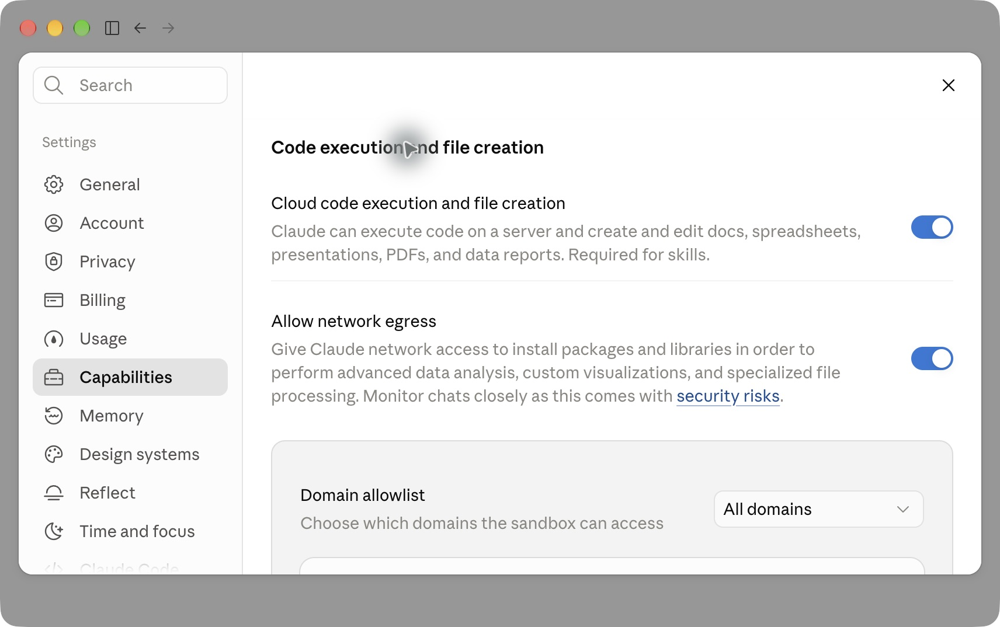
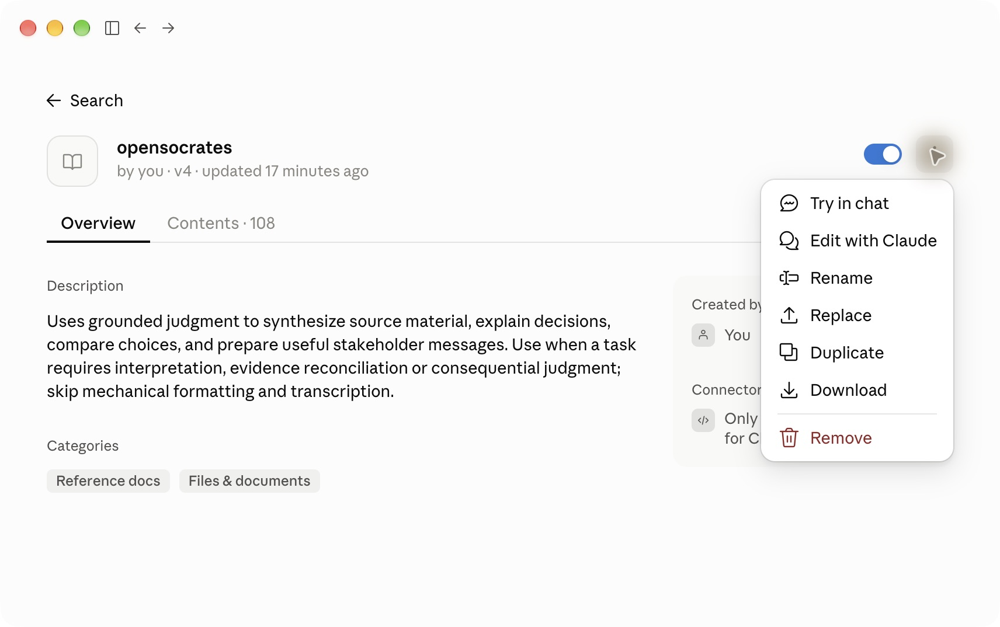
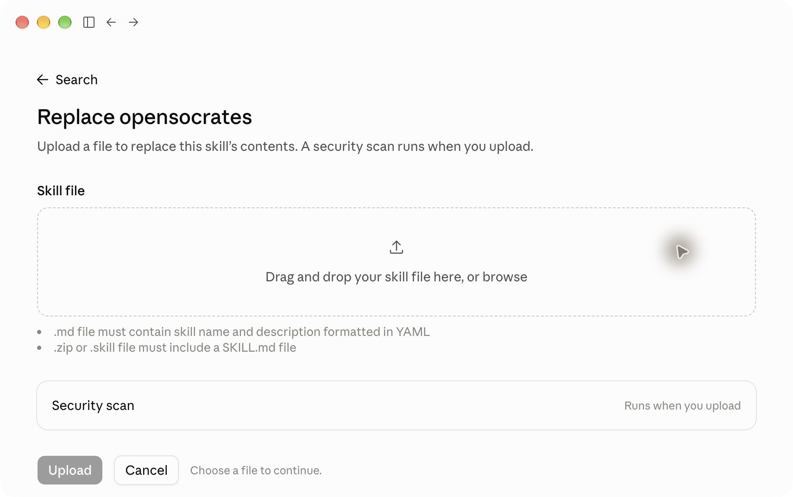
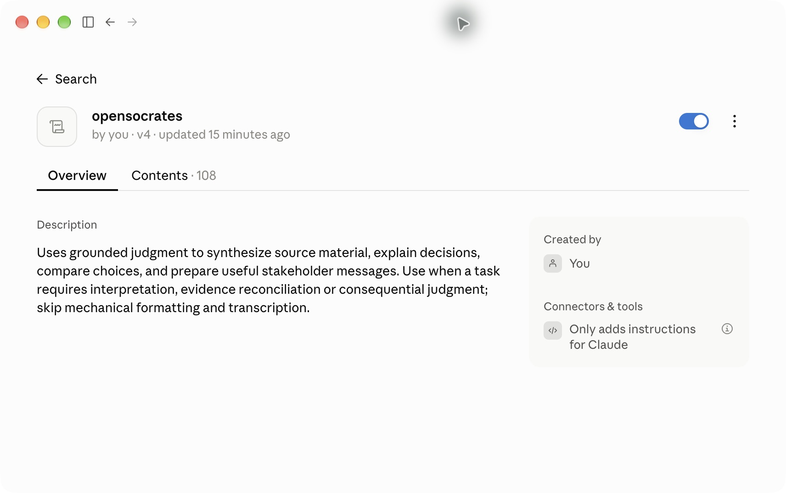
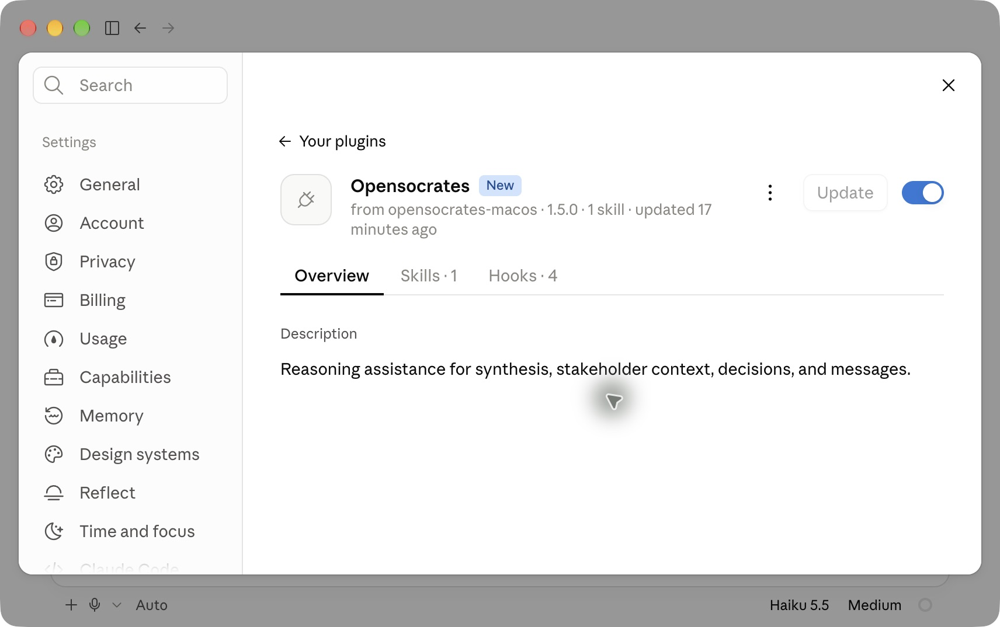
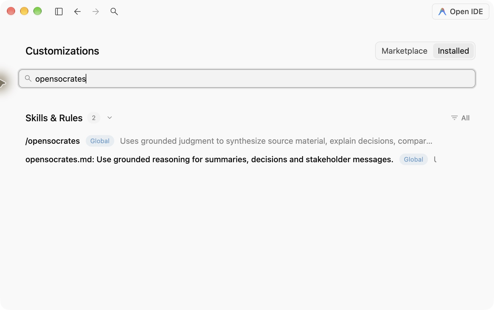

# OpenSocrates 1.5 post-installation setup guide

[한국어](setup-guide.ko.md) · [Install commands and supported platforms](../README.md) · [v1.5.0 downloads](https://github.com/ParkerHwang/OpenSocrates/releases/tag/v1.5.0)

After installation, check **only the apps you use**. Codex requires hook trust
approval. Claude account skills need the required capability and the skill to
be enabled. Claude Code needs its plugin enabled. In Antigravity, check the
installed rule and skill.

This guide is current as of October 10, 2026. Screenshots come from Claude
Desktop 2.31226.1 and Antigravity 2.22.0 on macOS. Codex CLI 0.145.0 commands and
the official hook guide were inspected. No Windows screenshots are included.
Menu names may vary by app version, language and account policy.

## What is automatic?

| Where you use it | What the installer handles | What to check afterward |
| --- | --- | --- |
| Codex | Package verification, plugin registration and activation | OpenSocrates hook trust in `/hooks`, any required approval, then a fresh conversation |
| Claude web / Desktop Chat / Cowork | Account ZIP verification and export | Code execution and the OpenSocrates skill enabled in the correct account |
| Claude Code, local Mac | Native plugin installation, registration and activation | Plugin enabled in local Code, then a fresh session |
| Antigravity | Rule and skill files in the selected global or workspace scope | Rule and skill visible in that scope in the app, then a fresh conversation |

**`--host all` means Codex only.** Specify each other app separately. Claude on
Windows uses the account skill. v1.5.0 has no native Windows Claude Code package.

## Ask an agent to finish setup

Paste the following request into an agent that can access your computer and
files. Adjust the target apps as needed. This request uses the existing v1.5.0
installer commands and host interfaces; it does not add a separate `setup`
command.

```text
Finish installing and setting up OpenSocrates 1.5.0 on this computer.
The targets are Codex, Claude and Antigravity that are currently installed here.
Official setup guide:
https://github.com/ParkerHwang/OpenSocrates/blob/main/docs/setup-guide.md

First check the operating system, required runtimes, current versions and
enabled states. Install any missing integration and update existing ones
with the official 1.5.0 package. Leave correctly configured items alone.

Distinguish Codex, the Claude account skill, local Mac Claude Code and Antigravity.
Respect that --host all handles Codex only.
Avoid duplicate global and workspace Antigravity entries. Preserve intentionally
disabled test copies and unrelated settings.
Before replacing a Claude account skill, back up its files and enabled state.

Proceed with installation, file verification, plugin registration, permitted
ordinary settings and completion checks. If a step requires my login,
organization administrator access or actual host hook trust approval, open
that screen and explain what I need to click and why.
Do not fabricate approval records, use approval-bypass options or lower
security settings across the app.

Verify without additional model-answer tests.
At the end, report each app's installed version, enabled state, hook approval
where applicable, actions I need to take and anything you could not verify.
Do not mark an unobserved state as complete.
```

If the agent cannot access app interfaces, let it handle CLI installation and
verification, then follow the screen steps below yourself. Account login and
organization policies cannot be resolved by the installer.

## 1. Codex: review and approve OpenSocrates hooks

Hooks are small programs that run at events such as session start. Codex manages
plugin installation and hook trust separately. New or changed hooks are skipped
until reviewed and approved. [Official OpenAI hook guide](https://learn.chatgpt.com/docs/hooks)

1. Check the installation state first.

   ```sh
   npx --yes opensocrates@1.5.0 status --host codex
   ```

2. Start **interactive Codex** in a terminal in your usual project folder.

   ```sh
   codex
   ```

3. Enter `/hooks` in the Codex input field. This is not a command for your shell.
4. Find entries from `opensocrates@opensocrates`. Review their commands and
   origin, then approve the OpenSocrates entries you trust using the host's
   trust controls. Already trusted entries need no new approval.
5. Check that all seven OpenSocrates entries are approved, then start a fresh
   conversation.

| OpenSocrates hooks | What to check |
| --- | --- |
| SessionStart / UserPromptSubmit | Entry at session start and request submission |
| PreToolUse / PostToolUse | Retained host integration |
| PreCompact / Stop / SessionEnd | Context, response and session-end lifecycle integration |

**Complete when:** the plugin is enabled, the current OpenSocrates hook
definitions are trusted and you can start a fresh conversation. An “installed”
result from `status` alone does not verify activation or hook approval.
A separate `codex hooks` shell command and `opensocrates diagnose --host codex`
are not supported verification paths in this version.

The Codex section follows the official CLI procedure. Actual screenshots are
in the Claude and Antigravity sections below; the [capture scope](assets/setup-v1.5/README.md)
is recorded separately.

## 2. Claude account skill: enable the capability and skill

This section is for **web Chat, ordinary Desktop Chat and Cowork**. The local
Claude Code plugin is separate. If your browser and Desktop use different
accounts, check each account's settings separately.

### 2-1. Check the capability required for Skills

For a personal account, open `Settings → Capabilities` and confirm that
**Cloud code execution and file creation** is enabled. If Team or Enterprise
settings are locked, ask your organization administrator to check whether
Skills and code execution are allowed.
[Official Claude Skills guide](https://support.claude.com/en/articles/12512180-use-skills-in-claude)



Figure 1. Check **Cloud code execution and file creation** at the top. Network
access and the all-domains setting below it are not additional requirements for
installing OpenSocrates. You do not need to copy those existing settings from
the screenshot.

### 2-2. Upload or replace the account ZIP

For a first installation, go to
`Customize → Skills → + → Create skill → Upload a skill`. If the menu names
have changed, find upload in the Skills creation menu. Use
**`opensocrates-1.5.0-claude-chat-skills.zip`**, not the native Code
`claude-plugin.zip`.

Download the account file from the
[release page](https://github.com/ParkerHwang/OpenSocrates/releases/tag/v1.5.0),
or export it to a new absolute filename in an existing directory:

```sh
npx --yes opensocrates@1.5.0 export --host claude-chat --output /absolute/path/opensocrates-1.5.0-account.zip
```

If OpenSocrates is already present, use that skill's `… → Download` to back it
up, record its enabled state, then choose `… → Replace`. Leave other skills alone.



Figure 2. Use **Download → Replace** to preserve the existing skill before
replacing it.



Figure 3. Select the account ZIP and click **Upload**. This screenshot shows
replacement of an existing skill; the title may differ when adding one for the
first time.

### 2-3. Confirm that the skill is enabled

After upload, check the `opensocrates` toggle. Leave it blue and enabled, then
start a fresh conversation.



Figure 4. The toggle on the right is enabled. The `v4` beneath the name is the
revision number for this skill in the Claude account. **It is separate from the
OpenSocrates product version, 1.5.0.** To check the product version, look for
`OpenSocrates 1.5.0` in `Contents → SKILL.md`.

**Complete when:** the account skill is in the correct account, and both the
required capability and skill are enabled. Account skills have no native hook
approval process like Codex.

## 3. Claude Code: check the local Mac plugin

This path is for terminal Claude Code and Desktop **local Code** on
Apple-silicon Mac. It does not verify Cloud, SSH, WSL or native Windows Code
installation.

```sh
npx --yes opensocrates@1.5.0 diagnose --host claude
```

Check `version: 1.5.0`, `enabled: true`, `integrity: verified` and
`registration: confirmed`. If the installed plugin is unintentionally disabled,
you can enable it with `npx --yes opensocrates@1.5.0 enable --host claude`.

In Desktop, go to **Code → Local → + in the input field → Plugins → Manage
plugins**, then open OpenSocrates. If the interface has changed, you can also
check the installed list under Plugins in Settings.
[Official Claude Code installation guide](https://code.claude.com/docs/en/plugins/install)



Figure 5. Check **`opensocrates-macos · 1.5.0` and the enabled toggle**.
`Hooks · 4` lists this plugin's configuration. This is separate from the account
skill screen.

In terminal Claude Code, `/plugin` shows plugins and `/hooks` shows hook origins
and contents. **Claude Code's `/hooks` is a read-only list.** Do not apply
Codex's seven-hook approval process here.
[Official Claude Code hook guide](https://code.claude.com/docs/en/hooks)

If a fresh local session shows project trust or permission prompts, review the
target folder and actions before proceeding. If organization policy blocks
hooks or `disableAllHooks` is set, check `/status` and administrator policy.
OpenSocrates does not require unrestricted permissions across the app.

**Complete when:** the correct local plugin is enabled and you can start a
fresh local session. Uploading the account skill does not replace local plugin
installation.

## 4. Antigravity: check both the skill and rule

For a global installation, use the command below. For a workspace installation,
add `--workspace` with the same absolute directory used during installation.

```sh
npx --yes opensocrates@1.5.0 diagnose --host antigravity
```

Check `version: 1.5.0`, `enabled: true`, `integrity: verified` and the intended
`scope`. **Avoid applying both global and workspace installations to the same
work.**

In Antigravity 2.22.0, open **Customizations → Installed** and search for
`opensocrates`. These two entries should appear under `Skills & Rules`:

- `/opensocrates`: the skill that reads the required content
- `opensocrates.md`: the always-on rule that points to the skill



Figure 6. **Global** on both entries means a global installation. For a workspace
installation, check the selected project's scope. Other versions may show the
same entries in the Rules or Skills tabs under Customizations, or in project
settings. [Official rules guide](https://antigravity.google/docs/rules) ·
[Official skills guide](https://antigravity.google/docs/skills)

OpenSocrates uses rule and skill files in Antigravity. **There is no separate
hook approval step**, and it does not need to appear as a plugin in the Plugins
card. Ordinary project file and command permissions apply separately when a
task needs them.

**Complete when:** the skill and always-on rule are recognized in the selected
scope and you can start a fresh conversation. Older conversations may retain
content from before removal or update.

## Commonly confused states

| What you see | What to check next |
| --- | --- |
| Codex reports installation but does not use hooks | Separate installation from approval; check current definitions' trust in interactive `/hooks` |
| Claude has the skill, but it is gray | Check code execution, organization policy and the skill's enabled state |
| It appears in Claude Chat but not in Code | Check the account skill and local plugin installation separately |
| OpenSocrates is absent from Antigravity Plugins | Search **Skills & Rules** under Installed |
| After updating, an answer shows `OpenSocrates grounding: …@3` | Check the actual installed version, older copies in other accounts/scopes and retained context in an existing conversation |
| `Powered by OpenSocrates` is absent | Simple work and answers using reader guidance alone do not qualify; do not infer installation failure from the footer alone |

`Powered by OpenSocrates` is conditional attribution for an answer that fully
reads and actually applies an eligible canonical method. Installation, hook
approval, complete reads, application and answer quality are separate checks.
Additional model-answer tests are not required to follow this setup guide.

## Detailed installation and recovery guides

- [Mac installation, updates, disabling and removal](macos-v1.5.md)
- [Windows installation and support scope](windows-v1.5.md)
- [Attribution and decision-point contract](decision-points.md)
- [Screenshot scope and provenance](assets/setup-v1.5/README.md)
