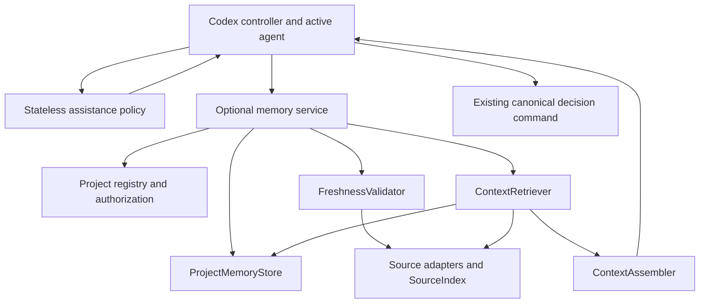

# Architecture and operating model

## Component boundaries

A stateless assistance policy recommends optional support from closed task features
and versioned model profiles. It complements the existing reasoning controller;
it never weakens mandatory method contracts. See 11 for its explicit command,
inputs, output, fallback, and completion rules. General and coding projects share
this policy and the memory service.

The existing reasoning controller and canonical methods remain the product's
general judgment layer. Memory is shared supporting context, and coding guides
are an additive domain layer. A coding task may need all three; a non-coding
judgment may use the reasoning core with appropriate available context and no
coding guide. A mechanical task may need none of the additional machinery.

At a material judgment point, the agent retrieves relevant prior public context
when useful and enabled, checks its applicability, selects an eligible canonical
procedure, and obtains the domain evidence the current decision requires. New
evidence may change the question or invalidate the old conclusion. Store only
permitted public outcomes and continuity, not private reasoning or reusable proof
that a previous agent read/applied a method. Retrieval never chooses the answer
by treating remembered conclusions as authority over current evidence.

The diagram represents responsibilities, not mandatory model calls. Retrieval,
fingerprinting, and state transitions are deterministic by default. The active
Codex agent supplies task intent and performs general or coding judgments. No embedded LLM,
extra API key, or separate Context Scout installation is required.

Two bounded source adapters ship initially: local Markdown/plain-text documents
for non-coding projects, and Git inventory with Python structural support for code.
Shared record and checkpoint semantics are domain-neutral. Remote services,
binary document parsing, and ordinary ChatGPT integration are outside this slice.

| Component | Owns | Must not own |
| --- | --- | --- |
| Assistance policy | Optional support level, matched profile, bounded context recommendation, completion guidance | Model switching, method selection, or proof of actual reasoning |
| Project registry | Explicit enrollment, root/worktree bindings, policy version, capabilities | Semantic acceptance of agent claims |
| ProjectMemoryStore | Typed records, versions, conflicts, checkpoints, retention | Automatic repository scans or arbitrary dictionaries |
| SourceIndex | Derived document/code inventory, symbols, attributed relationships, coverage | Authoritative design intent or claims of complete runtime behavior |
| FreshnessValidator | Source/coverage comparison and invalidation | Treating matching hashes as proof of semantic correctness |
| ContextRetriever | Scoped candidate search and ranking | Writing new beliefs during recall |
| ContextAssembler | Required constraints, bounded evidence, omissions, continuation handles | Silent truncation of required material |
| Coding guides | When to retrieve, inspect, decide, verify, and stop | New hidden permissions or unconditional repository-wide rituals |

Suggested source ownership: `src/opensocrates/project_memory/` for domain and
application modules; `src/opensocrates/cli/memory.py` for the explicit boundary;
existing platform persistence primitives through narrow adapters. Names are
proposed, not existing modules. Keep filesystem, SQLite, and host dependencies out
of pure record/state-transition models.

## Storage and authority

Use a separate owner-only `projects/` subtree of the existing secure product data
root. Each enrolled project owns `memory.sqlite3`, derived index data, a manifest
of managed files, and a registry of workspaces. Runtime state is never placed in the
installed plugin directory, written into Git automatically, or discovered by
trusting a repository-supplied database.

SQLite is the authoritative local store for memory record versions and checkpoints.
An inspect/export command produces readable Markdown/JSON; exports are snapshots,
not a second live authority. If a team chooses to check an exported decision into
its repository, later ingestion treats that document as a new attributed source.
Do not implement silent bidirectional synchronization.

Authority is claim-specific:

- Current source, relevant configuration, and observed execution govern implemented
  behavior. Stored descriptions are references to evidence, not substitutes for it.
- A documented user/maintainer decision governs intended behavior within its scope.
  Source disagreement creates a conflict; it does not erase that decision.
- An inferred relationship or agent design idea remains an inference/proposal.
- Source observations do not grant authorization. Existing permissions still apply.

Records are authoritative as records of what was decided or observed at a specified
state. They are not automatically authoritative about current project behavior.

## Project and workspace identity

Enrollment receives an explicitly chosen root, resolves it under the platform's
safe path policy, verifies ownership, and records a random `project_id` in the
private registry. For a Git repository, bind that registration to the canonical
Git common directory and filesystem identity. A remote URL or pathname alone is
not identity. Do not store remote URLs, which may contain credentials.

Each workspace receives a random `workspace_id`, bound to its canonical owned
root and project registration. `workspace_kind` is `git_worktree` or `directory`.
Git workspaces also bind their Git directory/common directory. Another worktree
with the same verified common directory may be explicitly enrolled under that
project. Non-Git projects enroll the chosen directory with filesystem identity
and scoped content/inventory snapshots; Git metadata is null/not applicable.

A clone, fork, copied directory, nested project, submodule, or relocated root is
not silently trusted or joined. Rebinding requires explicit intent and validation.
Non-Git checkpoints use project/workspace/task lineage, independent of a branch.

Checkpoint reuse requires the same project and workspace and a compatible task
lineage. Code observations require a compatible source snapshot. Explicitly
accepted project-scoped intent can be shared between enrolled worktrees, but it
must retain its scope and surface conflicts with each worktree's current source.
Do not use branch names as stable identities. A branch switch forces checkpoint
reconciliation and freshness checks even if a name is reused.

## Source snapshot and freshness

A snapshot includes HEAD when available, branch/ref metadata for diagnostics,
tracked staged and unstaged content, relevant untracked inventory/content,
exclusion-policy identity, adapter identity/version, and relevant build/lockfile
configuration. It is a scoped manifest, not a repository archive. Persist hashes
and source locations, not source bytes.

Freshness is evaluated against each record's footprint:

1. Positive source claims include exact file/symbol references and content digests.
2. Negative claims include the search descriptor, scope inventory digest, filters,
   tool version, and completeness state. New files/callers invalidate the claim
   even when the original implementation file is unchanged.
3. Test observations include the tested source/configuration footprint and execution
   provenance; a matching source digest alone does not certify execution.
4. Design intent can remain applicable while source changes; return a conflict if
   implemented behavior disagrees with it.

On recall, validate relevant dependencies before calling a source claim current.
Watchers may provide invalidation hints, but are not the correctness mechanism.
If a bounded check cannot establish validity, return `unknown` or `stale` and an
actionable refresh need. TTL alone is never sufficient. Unresolved dynamic edges
prevent a claim of exhaustive dependency coverage.

Hash and read source through safe handles; check identity/content before and after
collection. If a file changes mid-read, retry once within budget or return unstable
source. Do not silently combine two working-tree states into one observation.

For a non-Git text project, hash the allowed document inventory, referenced file
contents, exclusion policy, and adapter configuration. Edits invalidate positive
claims; new/deleted/renamed documents can invalidate negative search claims.
Use `project_document` references with relative paths and optional section/line
anchors. Existing exclusion, safe-handle, unstable-read, and coverage rules apply.
No source document bytes are persisted. Binary formats return an unsupported
capability; do not advertise a complete document parser.

## Indexing and retrieval

Index incrementally after explicit refresh or when a requested scope is invalid.
Keep record tables separate from regenerable index tables/generations. Rebuilding
an index must not delete decisions or checkpoints.

The required pipeline is: scope filtering → exact identifiers/path terms → bounded
lexical search → available structural neighbors → freshness validation → evidence
assembly. Rank by relevance, source directness, applicable scope, and freshness.
Recency alone must not displace a still-applicable constraint. Any scoring is a
retrieval heuristic, not a confidence probability.

Source snippets may be read into a transient response within the caller's access
scope. They are not persisted in the database, logs, or pack history. Lexical
edges are labeled lexical candidates; structural edges identify the adapter and
coverage. Build-time, reflection, callbacks, configuration, and runtime dispatch
gaps must be visible.

Context Scout's deterministic search/pack interface is a reference for this
adapter boundary. Reuse code only after source/license and behavior review; it is
not a required dependency or evidence that persistent memory already exists.

## Context assembly

Return a small project orientation, applicable constraints/decisions, current
evidence references and bounded excerpts, the relevant checkpoint, conflicts,
unknowns, and an expansion handle. Retrieve module and symbol detail only when it
can change the current action.

Separate required material from optional context. If required material cannot fit,
return `budget_insufficient` with an expansion/partition request; do not silently
truncate it or certify a partial pack as complete. A budget limits the returned
pack, not Codex's total context window. Source links and record identifiers must
survive every summary. Exact code facts needed for a change are checked against
source, not summary-of-summary text.

## Capture, resume, and conflicts

Capture a checkpoint after a material decision, a coherent patch plus relevant
validation, or a handoff. A pre-compaction event can help but is not required for
correctness. A fresh task can explicitly recall a checkpoint even if no hook ran.

Resume loads the requested project/worktree registration, checks the source state,
retrieves the task's latest committed checkpoint, exposes stale dependencies and
unresolved obligations, and only then proposes the next action. Never repeat a
side effect solely because a checkpoint says it was planned.

Writers provide `expected_record_version` or `expected_checkpoint_version` and an
idempotency key. Compare-and-swap failures return a conflict and the latest version;
they do not retry a semantic overwrite. Independent agent findings may be stored
as separate proposals. No last-writer-wins acceptance of contradictory decisions.

## Durability and failure

Use SQLite transactions and explicit bounded lock waits. Commit authoritative
record/checkpoint changes atomically. Index generations are replaceable. Start
with rollback-journal mode to reduce sidecar complexity; WAL is a later option only
after its owner permissions, checkpointing, and deletion behavior are validated.
Any SQLite journal/temp/backup is part of the owned storage boundary regardless
of mode. Do not depend on network-filesystem locking for the first release.

Version schema migrations. Back up only explicitly managed, permitted records,
apply a transactional migration, and verify before activation. An older runtime
must refuse writes to a newer unsupported schema. A corrupt store is unavailable;
never initialize an empty replacement under the same identity and report success.

Memory failures return explicit limitations and preserve ordinary authorized work.
That fail-open property does not remove a real task prerequisite: if a requested
action depends on a missing decision or authorization, hold that action and
continue independent work. Never fail open by treating missing evidence as approval.
