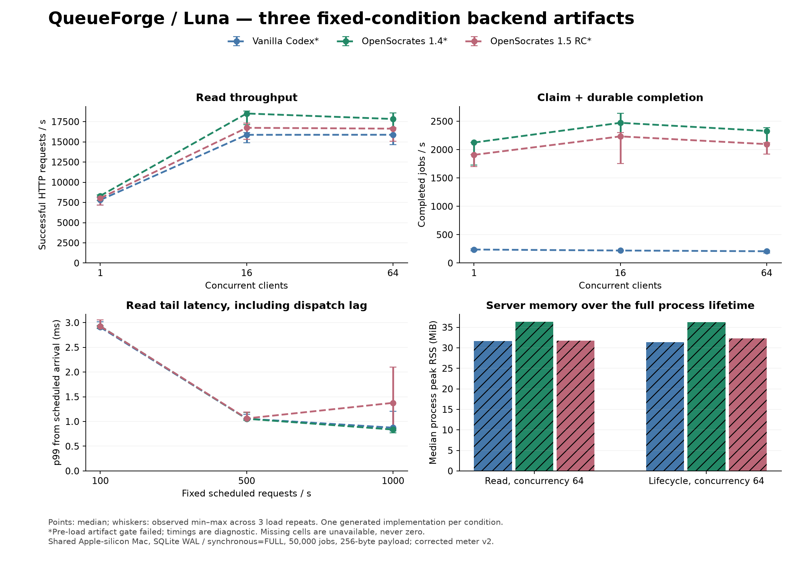
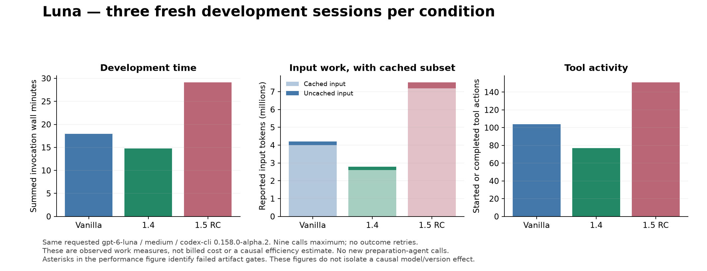

# QueueForge with Luna: vanilla, OpenSocrates 1.4 and 1.5 RC

The bounded Luna experiment made **9 outcome calls; 9 completed successfully as CLI turns**. Task correctness is reported separately below. There was no model substitution, stronger-model outcome assistance, automatic retry or integrator repair of a candidate artifact. All original Sol and Luna outcomes remain unchanged.

This repeats the same durable backend task: tenant isolation, idempotent single/batch writes, leased workers and fencing, retry/dead-letter state, scheduled priority work, quotas, cancellation, keyset pagination and migration of genuine preceding-stage data. It is one English three-session implementation episode per condition, not a broad model-quality study.

## Prospective controls and exact identities

All three conditions request **gpt-6-luna / medium / codex-cli 0.158.0-alpha.2**, with Go1.26.3 and modernc.org/sqlite1.59.0 locked. The first planned vanilla call checks current access before other calls start. A maximum of two independent builders then run at once; timed API loads never overlap models or builds. The invocation limit is nine, 1200s each, with no escalation. Model/backend echo and billing remain null.

Vanilla uses a disposable home/profile with zero additional plugins. The other profiles contain exactly one pinned local OpenSocrates package. Account-remote plugins/apps, hooks, native memories/import and subagents are disabled. Vanilla and 1.4 receive a maintained-note control with the same accepted intent as the explicitly enrolled 1.5 memory condition. No prior Sol code, answers, outcomes or repair hints enter the Luna workspaces. Compilation caches were primed from the common driver seed only.

| Identity | Value |
| --- | --- |
| Pre-outcome local freeze | `fa962c8dfa676e765b640d2327372de3e8a7d63e` |
| Luna manifest SHA-256 | `48964310f8c6c1b1db0821312bc9c6e903fa1deab7f1d37e9a00c8510db044a7` |
| Product input | `a8aaba572693c63419188ee2d45f59688b564b16` |
| Client SHA-256 | `50ab38ba21d0d9f8346f32f41848382f15b556190f3c7a07e885a4fb73e379c8` |
| Released 1.4 ZIP SHA-256 | `74efeab5797de766dabf8394506e29bcb39df3d1b3aac93a5a9ec17a32909a33` |
| Unpublished 1.5 RC ZIP SHA-256 | `1aae2efefc76c4e628ad2da7a63174f5d96e093b984fe0ed5551b66eaa6dae0d` |

The task texts, common starter and independent API checker are identical to the preceding Sol comparison. The corrected meter is used **before** outcomes here, so Luna's final session can receive valid own-arm preliminary performance feedback. The Sol final sessions received invalid/unavailable original meter feedback. Cross-model differences are therefore descriptive and confounded; they are not a controlled causal gap or gap-closing estimate.

## Correctness, tests and repairs

| Condition | Initial API | Extended API | Final API | Final own Go suite | Named domain Go test results |
| --- | --- | --- | --- | --- | ---: |
| vanilla | 4/8; 1 unassessable | 13/19; 1 unassessable | 17/19 | pass | 3 |
| v1.4.0 | 5/8 | 16/19 | 16/19 | pass | 0 |
| v1.5.0-rc | 8/8 | 18/19 | 18/19 | pass | 13 |

A successful `go test` invocation can cover only the supplied driver test; it does not prove authored domain tests. The named count excludes that driver test and can include subtests. Separate process scripts, their retained evidence and gaps are assessed in the [source review](SOURCE_REVIEW.md). External API scenarios use race builds, two processes sharing a database, controlled clocks, actual preceding-stage executables, atomic rollback and SIGKILL/restart. Passing these finite scenarios does not prove production security or physical power-loss behavior.

| Non-passing external scenario | Condition / stage | Recorded result |
| --- | --- | --- |
| validation_atomic_no_side_effects | vanilla / 1 | fail: Failure: POST /v1/jobs: expected [400], got 201 |
| two_process_idempotency_and_tenancy | vanilla / 1 | unassessable: temporary storage unavailable after three recorded contention attempts |
| atomic_bulk_and_replay | vanilla / 1 | fail: Failure: POST /v1/jobs/batch: expected [400], got 201 |
| live_lease_races_heartbeat_deadline_fencing | vanilla / 1 | fail: Failure: POST /v1/queues/mail/claim: expected [200], got 503 |
| validation_atomic_no_side_effects | vanilla / 2 | fail: Failure: POST /v1/jobs: expected [400], got 201 |
| two_process_idempotency_and_tenancy | vanilla / 2 | unassessable: temporary storage unavailable after three recorded contention attempts |
| atomic_bulk_and_replay | vanilla / 2 | fail: Failure: POST /v1/jobs/batch: expected [400], got 201 |
| two_process_claim_race | vanilla / 2 | fail: Failure: POST /v1/queues/mail/claim: expected [200], got 503 |
| cross_process_inflight_quota_expiry | vanilla / 2 | fail: Failure: POST /v1/queues/mail/claim: expected [200], got 503 |
| genuine_stage1_migration_two_startups_and_original_replay | vanilla / 2 | fail: Failure: POST /v1/jobs: expected [409], got 200 |
| two_process_idempotency_and_tenancy | vanilla / 3 | fail: Failure: GET /v1/jobs/1790434005596314000-031df11131470f0851bb691d656c7bc6: expected [404], got 503 |
| genuine_stage1_migration_two_startups_and_original_replay | vanilla / 3 | fail: Failure: POST /v1/jobs: expected [200], got 409 |
| validation_atomic_no_side_effects | v1.4.0 / 1 | fail: Failure: POST /v1/jobs: expected [400], got 201 |
| atomic_bulk_and_replay | v1.4.0 / 1 | fail: Failure: POST /v1/jobs/batch: expected [400], got 201 |
| live_lease_races_heartbeat_deadline_fencing | v1.4.0 / 1 | fail: Failure: POST /v1/queues/mail/claim: expected [200], got 503 |
| validation_atomic_no_side_effects | v1.4.0 / 2 | fail: Failure: POST /v1/jobs: expected [400], got 201 |
| atomic_bulk_and_replay | v1.4.0 / 2 | fail: Failure: POST /v1/jobs/batch: expected [400], got 201 |
| genuine_stage1_migration_two_startups_and_original_replay | v1.4.0 / 2 | fail: Failure: POST /v1/jobs: expected [409], got 200 |
| validation_atomic_no_side_effects | v1.4.0 / 3 | fail: Failure: POST /v1/jobs: expected [400], got 201 |
| atomic_bulk_and_replay | v1.4.0 / 3 | fail: Failure: POST /v1/jobs/batch: expected [400], got 201 |
| genuine_stage1_migration_two_startups_and_original_replay | v1.4.0 / 3 | fail: Failure: POST /v1/jobs: expected [409], got 200 |
| genuine_stage1_migration_two_startups_and_original_replay | v1.5.0-rc / 2 | fail: Failure: POST /v1/jobs: expected [409], got 200 |
| genuine_stage1_migration_two_startups_and_original_replay | v1.5.0-rc / 3 | fail: Failure: POST /v1/jobs: expected [409], got 200 |

## Server performance

The fixed schedule contains 18 preliminary and 81 final cells. Each available final cell uses 3s warmup and 10s measurement, with three repetitions per condition/workload. One server (GOMAXPROCS4) and one generator (GOMAXPROCS2) run serially on the same shared Apple-silicon Mac. Fresh copies of stopped, public-API-seeded databases contain 50,000 jobs across four tenants, 256-byte payloads and 10,000 read references. Timeouts, drops, scheduler lag, CPU, peak RSS, DB/WAL bytes and state conservation are retained. Unavailable cells stay null, never zero.

Cells whose correctness/self-test/dependency gates fail are diagnostic. Valid timing is not sufficient to qualify a speed advantage. The source review separately assesses durability settings and reuse. Values below are median (observed min–max; available repetitions), not confidence intervals.

| Final metric | Vanilla | 1.4 | 1.5 RC |
| --- | ---: | ---: | ---: |
| successful read HTTP/s, concurrency 1 | 7,806.70 (7,156.40–8,123.60; n=3) | 8,318.00 (7,720.90–8,438.00; n=3) | 8,038.20 (7,188.90–8,208.20; n=3) |
| successful read HTTP/s, concurrency 16 | 15,870.00 (14,878.00–16,132.80; n=3) | 18,509.50 (17,141.80–18,805.20; n=3) | 16,738.20 (15,286.40–17,322.50; n=3) |
| successful read HTTP/s, concurrency 64 | 15,877.90 (14,631.90–15,879.70; n=3) | 17,829.70 (16,723.60–18,599.80; n=3) | 16,632.50 (15,089.80–16,749.10; n=3) |
| completed jobs/s, concurrency 1 | 238.20 (219.30–250.30; n=3) | 2,124.80 (1,730.30–2,126.70; n=3) | 1,907.60 (1,699.50–1,914.40; n=3) |
| completed jobs/s, concurrency 16 | 220.80 (217.20–224.70; n=3) | 2,472.90 (2,235.80–2,639.10; n=3) | 2,233.30 (1,756.50–2,298.60; n=3) |
| completed jobs/s, concurrency 64 | 207.80 (179.10–218.70; n=3) | 2,328.40 (2,124.20–2,386.30; n=3) | 2,096.80 (1,919.30–2,117.70; n=3) |
| read HTTP p99 ms, concurrency64 | 18.14 (17.79–19.35; n=3) | 15.88 (15.32–17.00; n=3) | 17.17 (17.13–18.75; n=3) |
| read process CPU seconds, concurrency64 | 28.12 (27.92–28.70; n=3) | 23.53 (23.40–23.80; n=3) | 26.07 (26.00–26.49; n=3) |
| read process peak RSS MiB, concurrency64 | 31.66 (31.66–32.17; n=3) | 36.34 (36.34–36.72; n=3) | 31.77 (31.58–31.78; n=3) |
| lifecycle HTTP p99 ms, concurrency64 | 672.39 (618.08–795.34; n=3) | 44.77 (42.80–51.14; n=3) | 70.81 (67.46–76.28; n=3) |
| lifecycle process CPU seconds, concurrency64 | 14.01 (14.01–14.09; n=3) | 18.93 (18.50–18.97; n=3) | 20.31 (20.01–21.13; n=3) |
| lifecycle process peak RSS MiB, concurrency64 | 31.39 (31.03–31.91; n=3) | 36.23 (36.16–36.41; n=3) | 32.33 (32.11–32.72; n=3) |
| fixed 100/s reads, scheduled p99 ms | 2.91 (2.88–3.02; n=3) | 2.93 (2.88–2.94; n=3) | 2.92 (2.92–3.05; n=3) |
| fixed 500/s reads, scheduled p99 ms | 1.06 (1.04–1.15; n=3) | 1.05 (1.02–1.18; n=3) | 1.06 (1.06–1.20; n=3) |
| fixed 1000/s reads, scheduled p99 ms | 0.88 (0.81–1.21; n=3) | 0.84 (0.77–0.86; n=3) | 1.38 (0.85–2.10; n=3) |

There are 81/81 final cells with valid meter observations and 0/81 passing both the frozen artifact and observable load gates. The independent numerical audit checked 99 available cells and 8,633,384 retained samples including warmup. See [all cells](performance-cells.csv) and [the audit](measurement-audit.json).

Throughput counts matching start-cohort responses completed inside the measurement window; cohort/drain counts and latency remain separate. Lifecycle latency is per HTTP request, not end-to-end job latency. CPU/RSS cover process lifetime including startup/warmup/drain/state reads. Scheduled-arrival latency includes dispatch delay. This shared-host sweep is not a production maximum-capacity estimate.

Available final measurement cohorts contain 4,644,923 HTTP attempts and 0 recorded response/validation errors. All other counters, missingness and state conservation remain in the CSV. There are 281 dispatches later than one arrival interval. Preliminary vanilla cells retain 479,158 request failures; final load behavior does not erase its remaining API/legacy obligations.

## Development work and memory

| Observed sum across attempted sessions | Vanilla | 1.4 | 1.5 RC |
| --- | ---: | ---: | ---: |
| CLI invocation minutes | 17.91 | 14.73 | 29.14 |
| Tool actions | 104 | 77 | 151 |
| Nonzero tool actions | 8 | 4 | 17 |
| Input tokens | 4,212,416 | 2,793,755 | 7,523,545 |
| Cached input subset | 4,004,096 | 2,605,056 | 7,188,480 |
| Uncached input difference | 208,320 | 188,699 | 335,065 |
| Output tokens | 44,288 | 38,188 | 70,315 |
| Reasoning-output subset | 13,080 | 10,898 | 25,091 |

Cached input and reasoning output are subsets, not additive costs. Missing usage is null; explicitly reported zero stays zero. No new preparation-agent model calls occurred. The reused task/checker/meter were authored outside all treatments. All command attempts and nonzero results are retained; lookup misses are not automatically coding defects.

Observed native memory attempts: 17; operations {"checkpoint": 3, "inspect": 4, "recall": 2, "unclassified": 8}; captured status counts {"ok": 15, "unavailable": 2}. Routes: {"declared_adapter": 4, "direct_launcher": 8, "direct_marketplace_launcher": 5}. Integrator enrollment and post-call reads are separate. [Operation audit](memory-operations.json) links direct commands to retained typed responses where possible, and keeps missing response IDs/statuses null. Direct launcher calls bypass the declared adapter; source/package bytes and persisted checkpoint state are separate supporting evidence. An emitted pack is not universal application proof, and proposed checkpoints are not accepted decisions.

## Interpretation, boundaries and handoff

Read the [separate descriptive Sol context](sol-context.json) and [source and semantic review](SOURCE_REVIEW.md) for the actual defects, reusable paths, retained verification gaps and the resulting bounded conclusion. Report improvements, ties and regressions without repairing historical artifacts. One implementation per condition cannot establish broad quality/efficiency superiority, validate model profiles or isolate a memory effect. This is an English backend exercise; it does not establish Korean collaboration or every general-assistance capability.

The first cache priming attempt raced a still-running module-cache copy and failed before any outcome call. The failed cache was retained, a new copy completed synchronously, and common-seed priming then passed. A native method-selection request also needed its decision identifier corrected. Both are in the preparation ledger, separate from model outcomes. No old source or result was rewritten to pass.

Exact evidence includes the frozen manifest, all source stages, model/public-message receipts, checker results, [failure ledger](failure-ledger.json), [numeric summary](summary.json), [host/source preservation](preservation.json) and [reproduction instructions](REPRODUCE.md). The compact public export declares path/command-body transformations and original/export digests. Full raw timing samples remain only in the local synthetic evaluation boundary; aggregate exports cannot reconstruct every percentile without those samples.

Human scores, billed cost and independent backend model echo remain unavailable. Account-side native-memory transfer remains unproven. No global settings/memories or active plugin installation are changed, and no real project is enrolled. Live Windows Codex, destructive host tests and production deployment are outside this comparison. OpenSocrates remains an unpublished release candidate and PR95 remains Draft. Publication and active-install replacement require separate explicit authority.

`plan_objective_measure`: matched within-Luna backend comparison against vanilla and released controls, under the existing practical completion standard.

`do_scope`: at most nine fresh outcome sessions and the fixed 18+81 load schedule; no stronger-model answers, repairs or escalation inside a treatment.

`check_rule`: frozen input/source identities, actual API/state checks, qualified performance, all attempts and explicit missingness.

`act_standardize_decision`: retain observed bounded differences and failures; stop this experiment and do not promote a profile or expand a study automatically.

OpenSocrates grounding: pdca-cycle@3
