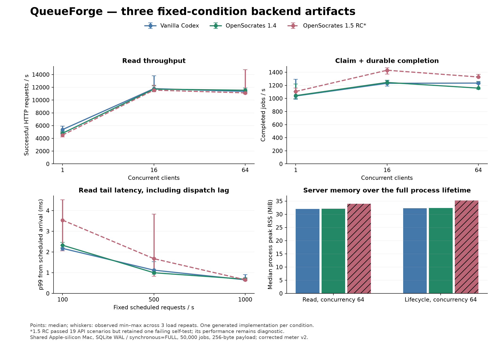
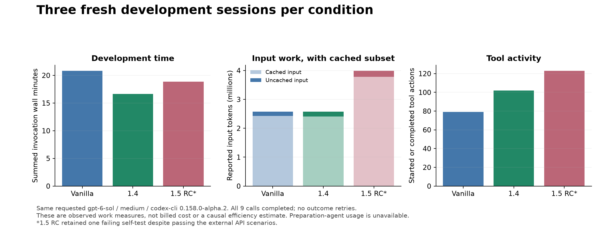

# QueueForge: vanilla Codex, OpenSocrates 1.4 and 1.5 RC

The three conditions completed the same durable backend and follow-up feature set. All final artifacts passed the 19 external API scenarios. Vanilla and 1.4 also passed their full self-test suites; the 1.5 artifact retained a failing, obsolete lifecycle assertion. This is a bounded comparison of three generated artifacts, not proof of a general version ranking.

**Nine development calls completed; zero failed model calls, retries or substitutions.** Six original performance cells were invalid because of a load-generator timer defect. The original records are preserved. A separately frozen correction measures the same stage-2 and stage-3 binaries with zero additional model calls.

## What was built and held constant

QueueForge is a durable multi-tenant job queue API, without a frontend: idempotent single/batch enqueue, leased workers with fencing, heartbeat/completion/failure, retry/dead-letter rules, priority/delayed scheduling, concurrent quotas, cancellation, snapshot pagination, and a transactional migration of genuine prior-stage data. The common seed supplied only the pinned SQLite driver helper/test. Final implementations contain roughly 1000 domain Go lines plus 500–600 test lines; size itself is not a quality score.

Each condition used three fresh `gpt-6-sol / medium` sessions through `codex-cli 0.158.0-alpha.2`. The bundled client SHA-256 is `50ab38ba21d0d9f8346f32f41848382f15b556190f3c7a07e885a4fb73e379c8`. Go1.26.3 and modernc.org/sqlite1.59.0 were identical and locked. Permission was workspace-write, approval never, localhost tests allowed, external dependency downloads disabled. No stronger-model assistance, subagents, other-condition code or evaluator solutions entered a treatment.

Vanilla had zero plugins; 1.4 had only the actual released local package; 1.5 had only the repaired unpublished RC. Hooks, native memory/import, account-remote plugins and connector apps were disabled in all disposable profiles. A failed setup preflight discovered 22 inherited remote catalog entries and was repaired before any outcome call. Vanilla and 1.4 had a competent maintained-note control; 1.5 used explicitly enrolled memory with the same accepted intent and a transparent native-envelope adapter. This compares those complete conditions, not an isolated memory mechanism.

| Input identity | Exact value |
| --- | --- |
| Product candidate source | `a8aaba572693c63419188ee2d45f59688b564b16` |
| Released 1.4 ZIP SHA-256 | `74efeab5797de766dabf8394506e29bcb39df3d1b3aac93a5a9ec17a32909a33` |
| Repaired 1.5 RC ZIP SHA-256 | `1aae2efefc76c4e628ad2da7a63174f5d96e093b984fe0ed5551b66eaa6dae0d` |
| Original pre-outcome freeze | `5f8b3a50d48cd15bd3302250e53e3d44f61242e5` |
| Original manifest SHA-256 | `2c490204c344a31cb88169430024114cf7ae6e9ab7e5d62f4e992a2700b54e73` |
| Corrected measurement freeze | `63e8167` |
| Corrected measurement manifest SHA-256 | `840e0f21ca65b810439940b1970bc564b2ee95ed4883f8ee843c254cdd7f926f` |

## Correctness and maintenance

| Condition | Initial API | Extended API before repair | Final API | Final own race tests |
| --- | ---: | ---: | ---: | --- |
| Vanilla | 8/8 | 18/19 | 19/19 | pass |
| OpenSocrates 1.4 | 8/8 | 18/19 | 19/19 | pass |
| OpenSocrates 1.5 RC | 8/8 | 18/19 | 19/19 | one test fails |

The common stage-2 failure was accepting an explicitly changed retry policy under a migrated idempotency key. Each final session repaired that failure. The candidate's remaining test expects immediate reclaim although its newly created job has the required 1000ms default delay. The server behavior is correct on that boundary, but the agent wrongly treated its own old test as a protected supplied test. This maintenance mistake was reported honestly and remains failed. See the [source review](SOURCE_REVIEW.md), including the specific files and scope interpretation.

All three reuse the same business/transaction paths across single and batch input. Vanilla and 1.5 separate HTTP and storage; 1.4 combines those responsibilities in one service. The candidate centralizes lease actions but is not uniquely reusable or primarily functional. Source review found WAL, synchronous=FULL, BEGIN IMMEDIATE and one SQL connection in each artifact. Process-crash recovery was tested; power loss and connection-fault injection were not.

## Measured server behavior

The corrected schedule has 18 stage-2 cells and 81 final cells. Final values below are median (observed minimum–maximum) across three load repetitions of the same artifact. Each cell has 3s warmup and 10s measurement; server GOMAXPROCS4, generator GOMAXPROCS2; all loads ran serially on the same shared Apple-silicon Mac (10 logical CPUs, 32GiB). Each cell starts from a public-API-seeded, stopped 50,000-job database across four tenants, with 256-byte payloads and 10,000 read references.

| Final workload | Vanilla | OpenSocrates 1.4 | OpenSocrates 1.5 RC* |
| --- | ---: | ---: | ---: |
| Read, 1 concurrent, successful HTTP/s | 5,379.4 (4,836.1–5,915.8) | 4,806.4 (4,710.0–5,103.9) | 4,524.6 (4,205.3–4,966.0) |
| Read, 16 concurrent, successful HTTP/s | 11,793.0 (11,700.7–13,806.4) | 11,719.1 (11,367.1–12,235.5) | 11,560.4 (11,290.5–12,341.6) |
| Read, 64 concurrent, successful HTTP/s | 11,356.9 (11,171.6–11,539.6) | 11,545.0 (11,270.0–11,882.0) | 11,134.0 (10,982.8–14,767.6) |
| Claim + complete, 1 concurrent, jobs/s | 1,037.2 (988.4–1,291.1) | 1,043.1 (997.2–1,220.3) | 1,106.7 (1,106.0–1,158.2) |
| Claim + complete, 16 concurrent, jobs/s | 1,231.4 (1,188.5–1,272.9) | 1,244.5 (1,228.1–1,279.8) | 1,430.9 (1,372.3–1,467.3) |
| Claim + complete, 64 concurrent, jobs/s | 1,234.7 (1,219.0–1,243.3) | 1,158.1 (1,142.2–1,260.6) | 1,328.0 (1,322.8–1,368.9) |

| Final latency/resource measure | Vanilla | OpenSocrates 1.4 | OpenSocrates 1.5 RC* |
| --- | ---: | ---: | ---: |
| read, concurrency64, HTTP p95 ms | 16.606 (16.054–16.643) | 16.125 (15.680–16.598) | 16.634 (12.517–16.894) |
| read, concurrency64, HTTP p99 ms | 25.467 (24.649–26.615) | 24.895 (24.000–25.597) | 25.156 (19.677–26.194) |
| read, concurrency64, server CPU seconds | 24.7 (24.1–25.0) | 25.0 (25.0–25.3) | 24.6 (24.5–25.6) |
| read, concurrency64, server peak RSS MiB | 32.0 (31.6–32.0) | 32.1 (31.6–32.2) | 34.0 (33.6–34.1) |
| lifecycle, concurrency64, HTTP p95 ms | 76.329 (76.163–77.713) | 81.163 (74.912–81.168) | 70.966 (68.947–71.830) |
| lifecycle, concurrency64, HTTP p99 ms | 116.751 (116.044–118.242) | 126.240 (115.855–129.156) | 107.920 (106.279–114.118) |
| lifecycle, concurrency64, server CPU seconds | 19.6 (19.6–19.9) | 19.4 (19.0–19.5) | 19.6 (19.3–19.6) |
| lifecycle, concurrency64, server peak RSS MiB | 32.3 (32.2–32.8) | 32.4 (32.0–32.8) | 35.2 (35.0–35.4) |
| Fixed 100/s reads, scheduled-arrival p99 ms | 2.173 (2.072–2.206) | 2.327 (2.320–2.462) | 3.538 (2.053–4.517) |
| Fixed 500/s reads, scheduled-arrival p99 ms | 1.123 (1.093–1.530) | 0.998 (0.926–1.038) | 1.677 (0.824–3.826) |
| Fixed 1000/s reads, scheduled-arrival p99 ms | 0.656 (0.620–0.903) | 0.687 (0.612–0.721) | 0.659 (0.614–0.763) |

*The 1.5 artifact's frozen self-test gate is still false. Its timings are valid measurements of that binary, but remain diagnostic rather than a fully qualified performance win. All stage-2 performance is likewise diagnostic because the migration-replay gate had not yet passed. No false gate is silently changed after inspecting a favorable number.

Throughput counts successful responses completed within the corresponding start-cohort measurement window. Full cohort/drain latency and timeout samples are retained separately. Lifecycle latency is per HTTP request, not whole-job end-to-end latency. CPU and peak RSS cover the server process lifetime (startup, warmup, measurement, drain and state inspection), not just the ten-second interval. Fixed-arrival p99 includes scheduling delay. The 1000/s sweep is not a maximum-capacity estimate.

Final measured totals: 3,384,130 attempted HTTP requests in measurement cohorts; 0 response/validation errors, 0 timeouts, 0 dropped scheduled arrivals, 0 duplicate acknowledgements, 0 idle claims, and 0 claimed-but-unacknowledged jobs. State conservation passed in 81/81 final cells. There were 227 dispatches later than one requested arrival interval; inspect scheduled latency rather than ignoring this shared-host scheduler noise.

## Development work and continuity

| Observed total, three sessions | Vanilla | OpenSocrates 1.4 | OpenSocrates 1.5 RC* |
| --- | ---: | ---: | ---: |
| Invocation wall time, minutes | 20.83 | 16.65 | 18.87 |
| Tool actions | 79 | 102 | 123 |
| Nonzero tool actions | 11 | 5 | 8 |
| Input tokens | 2,576,853 | 2,576,930 | 3,990,243 |
| Cached input subset | 2,426,624 | 2,404,736 | 3,780,224 |
| Uncached input (difference) | 150,229 | 172,194 | 210,019 |
| Output tokens | 42,740 | 38,945 | 43,747 |
| Reasoning-output subset | 9,970 | 7,430 | 9,214 |

Each receipt contains one usage report. Cache-write input is explicitly reported as zero; billing and independent backend-model echoes are null. Cached input and reasoning output are subsets, not additive costs. The v1.5 condition performed 13 successful model-initiated native operations: 3 recalls, 4 checkpoint writes and 6 inspects. One checkpoint progressed to version4 and remained proposed/agent_reported; the four accepted intent records are separately seeded fixture authority. Integrator setup/projection calls are separate. Memory worked here, while the maintained-note controls also supported the fresh sessions; no causal memory-quality gain follows.

The [failure ledger](failure-ledger.json) counts all 24 nonzero tool actions, including ordinary discovery misses, intermediate build/test/probe failures and the candidate's retained suite failure. Compact public command receipts do not reconstruct discarded stdout. Five Sol/medium preparation-agent turns authored/checked tooling outside treatments; their usage is unavailable and is not counted as zero. Human review is unavailable; the code review is the integrator's disclosed unblinded assessment.

## Failures, limitations and decision

The first timer bug escaped short mock tests. Six original cells cancelled at the warmup boundary; 93 scheduled original rows were then skipped, sometimes mislabeled `seed unavailable` by the old coordinator. Both original tool/results remain unchanged. A new long-duration regression and the corrected immutable manifest preceded all 99 corrected measurements. All stage-3 sessions had already received the invalid preliminary feedback. These final artifacts are correctness-repaired, not shown to be optimized using valid external load feedback.

This is one English backend project per condition on one shared host, with repeated load samples, not independent model replications. Session timing overlapped another development condition under a common concurrency ceiling of two; timed API loads never overlapped models or builds. Variation can come from code choices, generation randomness, cache/host/scheduler effects and the combined guide/memory condition. No broad superiority, numerical noninferiority, billing, account-side memory-isolation or universal hook-application claim is made. Authentication/TLS, deployment, distributed failure, physical power loss and production scalability are outside scope.

The practical result is a correctness tie on the external scenarios, a remaining candidate test-maintenance regression, real differences in code organization, and workload-dependent measured speed/resource tradeoffs. Vanilla is a competent baseline. These observations do not justify promoting a model profile or advertising universal coding/performance improvement. No product runtime, guide, schema, generated asset or active installation changed for this comparison. The candidate remains unpublished and PR95 remains Draft.

Next action: review these three frozen artifacts and the bounded tradeoffs alongside PR95. If the candidate demo is continued, update its obsolete self-authored test in a separately labeled derivative and verify that derivative; do not rewrite this outcome or launch another broad study. Product release still requires separate explicit merge/tag/publication authorization.

## Audit and reproduction

Local executed commands include `go test -race ./...` and normal/race builds per generated stage; `python3 protocol/checker/acceptance.py --binary <race> --stage N --legacy-binary <stage1-race> --output <new-result>`; load-tool Go race tests and `./loadgen --selfcheck`; four Python meter controls; and `python3 benchmark-v2/measure.py execute --sha256 840e0f21ca65b810439940b1970bc564b2ee95ed4883f8ee843c254cdd7f926f`. The corrected command executes zero models and verifies frozen hashes before/after. [Numeric audit](measurement-audit.json), [preservation](preservation.json), [machine-readable results](summary.json), and [all corrected cells](performance-cells.csv) record the actual outcomes.

The compact public export preserves synthetic source, contracts, checkers, model/public-message receipts and numeric summaries, with declared path replacement and original/export hashes. Full raw synthetic timing samples remain local with SHA-256 compression receipts. Public aggregate receipts alone cannot independently reconstruct every percentile; the local numeric audit checks retained samples. No raw hidden reasoning, credential, real-project contents or global memory data are retained.

`plan_objective_measure`: compare the harder backend under the same model/client, competent vanilla/released controls, correctness gates and measured load.

`do_scope`: nine planned sessions, three artifacts, fixed acceptance and 99 corrected load cells; one diagnosed meter repair, no extra outcome call.

`check_rule`: immutable source/input hashes, retained failures, request/state conservation, fixed timing definitions and all observed usage categories.

`act_standardize_decision`: retain the corrected meter; hold a generalized product advantage claim; stop this bounded comparison because the required observations are complete.

OpenSocrates grounding: pdca-cycle@3
