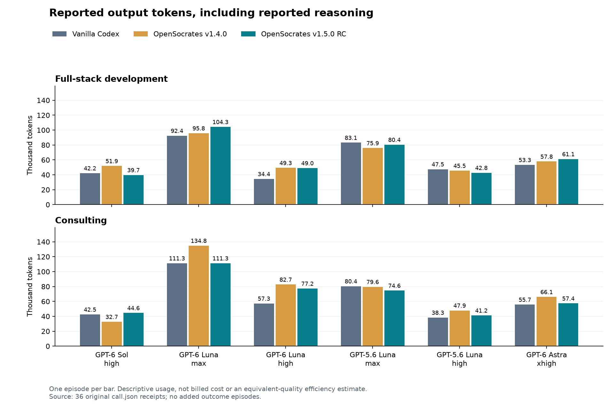
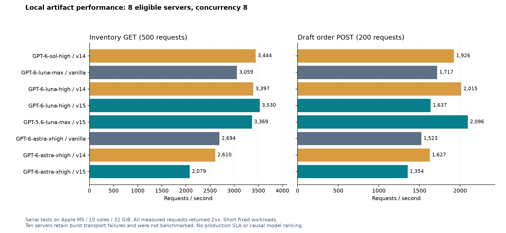

# OpenSocrates 36-episode comparison: qualified findings

**The v1.5 candidate does not show a consistent net advantage over vanilla Codex in these examples.** It often used fewer reported tokens than v1.4 in consulting, and some concrete artifacts improved. Other artifacts regressed. The useful result is a set of traceable implementation, calculation and measurement findings; it is not a universal quality ranking or a causal estimate of prompt effectiveness.

All 36 original episodes completed naturally. Their artifacts and observations were preserved before this analysis. No outcome model was rerun, coached or repaired. The primary performed unblinded source review, deterministic checks, disposable execution and sampled visual review. Human quality scores remain unavailable. PR95 remains Draft; the product is an unpublished release candidate.

[All 36 rows and performance table](TABLES.md), [machine-readable synthesis](summary.json), [flat observations](cells.csv), [original frozen protocol](../v2/manifest.json), and [fixed review procedure](../v2/REVIEW_PROCEDURE.md) make the conclusions recoverable.

## What was verified

| Evidence | Result | Interpretation |
| --- | ---: | --- |
| Natural process completion and terminal usage | 36/36 | Process completion is separate from artifact acceptance. |
| Original outcome episodes added during review | 0 | All new execution used disposable copies and mechanical checks. |
| Backend restart: stock, order count and idempotent response | 18/18 | Same database survived restart without reseeding. No power-loss test. |
| Browser order → reserve → ship → full return | 17/18 | Actual successful response, returned quantities and rendered state were checked. |
| Viewer controls after a known order was rendered | 18/18 | Read-only UI checks agree with API role checks within this scope. |
| Mobile inventory after all three SKUs were rendered | 17/18 | One390px viewport produced a 640px document. |
| Login form remains visible after authentication | 2/18 | Additional usability defects in two vanilla artifacts; not an auth bypass. |
| Original burst-concurrency transport failures | 10/18 | Retained connection errors; no demonstrated overselling follows from them. |
| Staged-connection stock/idempotency diagnostics | 10/10 | Application invariants held after removing the simultaneous TCP-accept burst. |
| Eligible servers independently benchmarked | 8/18 | Ten retain original transport failures and are not performance-equivalent. |
| Benchmark HTTP requests / post-exit stores | 11,200 / 16 | All measured responses 2xx; each store retained200 unique drafts and passed SQLite integrity. |
| Consulting base accounting and official-series values | 17/18 | One source-selection defect propagated across correlated metrics. |
| Feasible-pair scenario arithmetic | 16/18 | All44 feasible pair/scenario cases were checked per cell, including workbook-only representations. |
| Substantive archived source files retained exactly | 18/18 | All 13 input files matched original hashes; missing optional index.html is not a missing financial input. |

These denominators cover different questions and must not be averaged into an overall quality percentage. A successful main flow can coexist with a login-panel or mobile-layout problem.

## First-pass scores and diagnostic boundaries

The original qualification outcomes remain unchanged in [qualification-v1](../qualification-v1/manifest.json). Several evaluator assumptions required separate diagnostics:

- The first sandbox preflight used an unresolved `/var` alias that did not match `/private/var`; resolving the path fixed the evaluator before any candidate ran. Both preflight attempts are recorded.
- The first coding pass blocked `/dev/null`, so two Bash startup guards could not check Python availability. [Diagnostic v1](../qualification-diagnostic-v1/manifest.json) allowed that device in its disposable sandbox and ran the original checks on unchanged copies. These were evaluator setup failures.
- The frozen browser helper checked `locator.count()` before Playwright could wait for an asynchronously rendered control. A `returned` substring also matched table headings, and absence of a viewer button could be checked before the orders page appeared. [Waiting diagnostics](../qualification-diagnostic-v1/manifest.json), [the additional newly executable cell](../qualification-diagnostic-v2/manifest.json), and [semantic readiness diagnostics](../qualification-diagnostic-v3/manifest.json) preserve old scores while checking actual responses and rendered state. Visual inspection then found mobile captures on a loading or previous view, so [mobile readiness](../qualification-mobile-v1/manifest.json) measured only after inventory rendered.
- Ten first-pass concurrency groups raised transport exceptions. The staged-body diagnostics pre-sent headers, then released 20 reservation or 12 identical-create bodies concurrently. All ten preserved stock and single-effect invariants. Original burst failures remain real robustness observations. Default listen backlogs co-occur with these failures, but this does not independently prove the sole cause. The frozen request logger omitted requests that raised a transport exception before logging; exact original failed-HTTP-request counts are therefore unavailable. New diagnostics retain every scheduled response/error.
- Exact consulting-array membership rejected legitimate extra pair/defer or EUR=1 rows. Two payback-only failures used two-decimal values while the task specified no0.001-year precision. These are reported separately from arithmetic. Extra rows were subsequently checked, not automatically accepted.
- One API price-authority group rejected a400 response to an extra client price field. The task prohibits overriding server prices but does not explicitly require accepting and ignoring extra fields. Safe rejection is not evidence of a manipulated price.

The [semantic annotations](office-semantics.json), [workbook pair checks](office-pair-workbook-checks.json) and original scores are all retained. None is a replacement historical score.

## Coding findings and source structure

All 18 subjects chose Python's standard-library HTTP server, SQLite and plain JavaScript. The comparison therefore does not demonstrate an advantage in language selection or framework use. It is a greenfield task with detailed requirements, not a brownfield reuse or fresh-session memory experiment.

Focused source inspection found a common useful pattern: tenant-scoped queries, authorization before idempotent replay, an explicit mutation transaction and stored successful responses. The executable checks corroborated the tested invariants. Astra separated HTTP, database and service modules in all three arms. Most other outputs kept these responsibilities in one Python file. File count, line count and functional-programming style were not quality scores; no durable maintainability advantage was established from this one task.

| Tuple | Material within-tuple observations |
| --- | --- |
| GPT-6 Sol / high | All main flows worked. v1.4 handled the original burst and was benchmarked; vanilla/v1.5 retained connection failures. v1.5 used fewer output tokens here, but that is not an equivalent-quality efficiency win. |
| GPT-6 Luna / max | Main flows and restart worked in all arms. v1.4/v1.5 retained burst errors; vanilla handled the burst but left the login form visible. v1.5 retrieved all three specialists and produced more output than either control. |
| GPT-6 Luna / high | v1.4/v1.5 handled the original burst; vanilla did not. Main browser workflows worked. All remained compact single-file backends, so source organization did not establish a clear v1.5 advantage. |
| GPT-5.6 Luna / max | v1.5 handled the burst and passed the actual browser flow after the evaluator setup correction; vanilla/v1.4 had burst errors. All used substantial single-file backends with reusable mutation functions. This is one concrete favorable v1.5 example, not attribution to a particular prompt. |
| GPT-5.6 Luna / high | v1.4 overflowed mobile. Vanilla kept the login form visible. v1.5 failed Add line because a reusable button helper did not specify button type and the form did not prevent native submission. Its search control also updates state without refetching/filtering the rows in the inspected source; that latter finding is source-supported, not a separately executed UI test. |
| GPT-6 Astra / xhigh | All three arms had separated modules, passed critical API/restart and actual browser flows. v1.5 used an extra authorization/connection stage before parsing mutations; v1.4 already rechecked authorization within its transaction. The observed v1.5 local write throughput was lower. No unambiguous overall code-quality gain was established. |

Concrete source anchors:

- [v1.5 GPT-5.6 Luna/high button helper and form](../v2/results/fullstack-gpt-5.6-luna-high-v15/artifact-export/static/app.js): lines 6,19–20. `button()` leaves native submit behavior implicit; Add line is inside a form. The failed interaction is retained in the readiness diagnostic. This is a generated-application defect, not an OpenSocrates runtime bug.
- [v1.4 GPT-5.6 Luna/high mobile table](../v2/results/fullstack-gpt-5.6-luna-high-v14/artifact-export/styles.css): line 55 sets a590px table minimum; the measured document is640px at a 390px viewport.
- [v1.5 GPT-5.6 Luna/max mutation boundary](../v2/results/fullstack-gpt-5.6-luna-max-v15/artifact-export/app.py): lines 657–710 separate authorization, retry lookup, callback execution and commit/rollback. Comparable central mutation helpers also exist in controls; reuse itself is not unique to v1.5.
- [v1.5 Astra request ownership](../v2/results/fullstack-gpt-6-astra-xhigh-v15/artifact-export/depotflow/server.py): lines 94–132 perform preflight authorization, consume the body outside the write transaction, then reauthorize and commit. This source property is observable; its causal relation to the specialist text and its net performance benefit are not established.

Five of six v1.5 coding episodes emitted a complete frozen specialist body in public tool output. GPT-5.6 Luna/high did not. Both max-effort Luna tuples retrieved all three specialists; the other three retrieved transitions. [The delivery audit](../qualification-v1/guidance-delivery.json) matches exact package-body hashes. It establishes delivery, not private cognitive application. The nonreader remains in package-level results and is not silently removed to improve the comparison.

## Consulting: consequential errors behind plausible documents

The most important differences were semantic, not JSON shape.

**GPT-6 Luna/high with v1.5 selected the largest historical cost rather than the latest applicable cost.** In [analysis/analyze.py](../v2/results/consulting-gpt-6-luna-high-v15/artifact-export/analysis/analyze.py), line 109 uses `max(v for d,v in costs[...] if d<=shipped_at)`. SENSOR cost falls from43.00 to41.50 in July. The chosen operator keeps43.00 and overstates net COGS by **EUR19,333.50** across the six countries. Monthly, annual and scenario errors share this root cause; they are not independent failures.

**The same result also combines country effects incorrectly.** Lines160–175 multiply summed shipped units by summed per-unit savings, creating cross terms. The stress calculation additionally applies the FX shock to all pair revenue whenever either member uses PLN/CZK. [GPT-5.6 Luna/max vanilla](../v2/results/consulting-gpt-5.6-luna-max-vanilla/artifact-export/scripts/analyze.py), lines 544–569, has the same savings-composition error, although its FX shock is correctly country-scoped. Its [verification script](../v2/results/consulting-gpt-5.6-luna-max-vanilla/artifact-export/scripts/verify_outputs.py), lines 112–121, repeats the erroneous aggregation. An independently written-looking script is not an independent expectation.

| NLD+ESP annual increment | Correct additive reference | GPT-5.6 Luna/max vanilla | GPT-6 Luna/high v1.5 |
| --- | ---: | ---: | ---: |
| Base | EUR166,931.43 | EUR269,815.42 | EUR268,159.80 |
| Defined stress | EUR107,630.13 | EUR210,514.13 | EUR208,858.51 |

The v1.5 Luna/high artifact's own single-country values sum to165,275.80 and105,974.51, so its pair error is distinct from its cost-selection error. Both affected artifacts have 44/44 incorrect feasible pair/scenario rows. Other cells' pair values were checked in JSON or, for two controls, their actual workbook cells. A cent-level difference from summing rounded country figures is tolerated consistently with the original monetary checker.

The v1.5 Luna/high report/deck also state80,436 shipped units and the report states EUR4.036m net sales; the saved metrics/reference give77,436 units and EUR4,383,791.76 net sales. Those statements were manually embedded in [build_outputs.py](../v2/results/consulting-gpt-6-luna-high-v15/artifact-export/analysis/build_outputs.py): line 86. This is output binding/transcription drift beyond the cost error. Its PDF's90-day table has overlapping cells. The favorable-looking recommendation cannot validate its support.

A different recommendation is not automatically wrong. GPT-6 Luna/high v1.4 chooses NLD+ESP using a disclosed maximin preference, with correct low/base/high/stress values. Its choice is consistent with the task. GPT-5.6 Luna/max v1.4 and v1.5 both avoid the vanilla pair error. Astra's three arms all produce coherent conditional recommendations and identify the gap between assumed savings and the recorded cost pool. These are bounded examples, not model-profile validation.

All 18 retained the 13 substantive source-room files exactly. Public-source collection was primarily from the frozen local archive, not equivalent to unconstrained live market research. Official GDP/population and synthetic operating data answer different questions; their coexistence does not independently prove hub demand.

## Documents and rendered evidence

The primary inspected a sampled report page, board-deck page and workbook range for each consulting cell (54 samples), plus targeted follow-up pages and browser images. All PDF pages were text-extracted, but not every page received a visual or semantic audit. PPTX was rendered through bundled LibreOfficeDev26.8; workbook ranges through the bundled Artifact Tool. Original documents were not edited.

Material examples include the Luna/high v1.5 report's table overlap and GPT-5.6 Luna/max vanilla's overlapping deck title/card content. Most other sampled pages were legible, with sources, options and conditional implementation gates. This is a sampled assessment, not a claim of perfect typography or complete chart coverage.

Renderer defects were separated from candidate defects. Artifact Tool displayed `#VALUE!` for Astra/v1.4 `Decision!A7`, while the original cache and an independent LibreOffice recalculation both gave 198,099. It also omitted Sol/v1.5's title fill/text in the imported preview, while LibreOffice rendered the title. Astra/v1.5's closely placed KPI values remain a layout issue in the native conversion. Workbook print layouts were not uniformly prepared for clean PDF export, but PDF export was not required of the XLSX deliverable. See [document inventories and samples](documents/) and [targeted native cross-checks](native-workbook-review/).

## Usage and time

The 36 terminal receipts report208,797,105 input tokens, of which202,480,256 are the cached subset; derived noncached input is6,316,849. Reported output is2,342,204, including715,800 reasoning-output tokens. These subsets are not added again. Billing and complete backend-request usage remain unavailable. There are2,329 public tool items and237 nonzero/failed items; an item may contain multiple operations, and failures/repeated commands are not automatically wasted work.

All six Astra episodes have reconnect events,20 public error events in total. These are native retries inside the existing episodes. They do not create additional independent subjects, and their exact backend request count is unknown. The user-authorized concurrency change from3 to19 active subjects and its overlap with older calls remain part of timing interpretation.

| Descriptive median of six matched v1.5/baseline ratios | Total input | Noncached input | Output | Tool items |
| --- | ---: | ---: | ---: | ---: |
| Coding / vanilla | 1.415 | 1.082 | 1.048 | 1.065 |
| Coding / v1.4 | 0.907 | 0.894 | 1.026 | 1.133 |
| Consulting / vanilla | 1.339 | 1.196 | 1.039 | 1.159 |
| Consulting / v1.4 | 0.825 | 0.920 | 0.901 | 0.984 |

Consulting v1.5 reports lower total input and output than v1.4 in 5/6 tuples, with Sol the exception. That is an observed resource pattern, not a causal or equal-quality efficiency gain. Against vanilla there is no consistent reduction. Max effort is not a guarantee: GPT-5.6 Luna/max vanilla's pair arithmetic fails where its high-effort example is correct. No default model, effort or profile is promoted.



[Noncached input figure](noncached-input.png) and the complete [per-cell table](TABLES.md) retain the individual observations rather than hiding them behind an aggregate.

## Independent artifact performance

Eight eligible servers received the frozen concurrency 1/8 workloads, serially, on Apple M5 (10 cores,32GiB), Python 3.12.14. Each concurrency used a fresh database,500 inventory GETs and200 unique draft POSTs. All 11,200 responses were2xx. Read-only post-exit inspection of all 16 stores confirmed200 drafts and SQLite integrity; [state receipts](performance-state-checks.json) supplement HTTP status.

Astra is the only tuple with all three arms eligible. At concurrency 8, its vanilla/v1.4/v1.5 read rates were2,694/2,610/2,079 requests/s and write rates1,523/1,627/1,354 requests/s. Write p95 was11.72/10.86/21.32ms. The HTTP checker used coordinator Python 3.14.4; the servers used Python 3.12.14. The v1.5 source opens a separate preflight connection and rechecks authorization; that is a plausible contributor, not an isolated causal diagnosis. All three use SQLite FULL synchronous mode. Other artifacts' connection and durability choices also differ. No power-loss or production-capacity equivalence is claimed.



These are short, fixed local workloads, not saturation/endurance studies or a production SLA. Ten transport-failing servers remain unmeasured here; missing performance is not zero. The [full table](TABLES.md) includes each eligible server and links back to per-request evidence.

## What this suggests for v1.5

The most actionable product hypothesis is to connect guidance to the exact source-dependent operation that can fail. This calls for more selective, concrete help, with the existing task-based fallback; the data does not justify expanding generic instructions or promoting candidate model profiles.

1. **Bind authority to the selection operation.** An effective-dated record needs a maximum by applicable date, not by numeric value. A code/content checkpoint can name the governing field, caller and counterexample (a later lower cost).
2. **Preserve scope when composing effects.** Compute each country's units×saving and FX adjustment before aggregation. Carry grain/key/unit provenance through reusable helpers. Dimensional units alone do not expose the cross-country product-of-sums error.
3. **Make helper side effects explicit.** A reusable button constructor must specify native form behavior. A render function must not masquerade as a fetch/filter operation. Relate the advice to actual callers and state transitions.
4. **Use independently derived expectations and observable completion.** A verification script repeating the same erroneous formula cannot refute it. UI checks need completed state/response evidence, not a matching heading or an absent control during loading. Generate report text/tables from reviewed calculation results rather than manually copying numbers.
5. **Measure delivery separately from effect.** Keep the nonreader in package outcomes, record complete-guide delivery cheaply, and test a narrowly changed prompt only when the next product change is actually authorized. Do not infer less internal reasoning from shorter text or treat a reported grounding line as native application proof.

These are proposed interventions supported by failure mechanisms, not demonstrated fixes. The task supplied many invariants explicitly, so a ceiling/redundancy effect is possible, but it is not a reason to weaken the baseline or disregard regressions. No new study or outcome calls are part of this handoff.

## Provenance, verification and remaining limits

Generation source/package baseline: `035fafcd208bf9577ca55ff5e42a93df4ca608ea`; pre-call v2 freeze: `6fe19fe4b7450a2f68dd6fc4001b05ff2b832ae1`; all-outcomes evidence head: `9fa57bc109cea1a484eba31ce4bda5e17039d744`. The actual generation client was ChatGPT-bundled `codex-cli 0.158.0-alpha.2`; exact executable, package and guide hashes are in the frozen manifest. v1.4 archive SHA-256 is`74efeab5797de766dabf8394506e29bcb39df3d1b3aac93a5a9ec17a32909a33`; v1.5 RC archive SHA-256 is`52994553d51e8fd65285165d39ea004be819e56da8dab99c22968591a165dc76`.

The six exact requested tuples were GPT-6 Sol/high, GPT-6 Luna/max, GPT-6 Luna/high, GPT-5.6 Luna/max, GPT-5.6 Luna/high and GPT-6 Astra/xhigh. Fast was off. Experimenter-imposed model time/token/tool/output/internal-retry budgets were null. Every treatment had its own disposable profile/workspace; local isolation preflights passed. Product memory was unenrolled and hooks disabled. This is an English, explicitly cued installed-package comparison, not proof of memory effects, automatic hook delivery, bilingual benefit or broad superiority.

The complete source suite was run during this analysis:

```text
make bootstrap format-check lint generated-check content-check adjudication-check docs-check governance-check package-check security-scan smoke installer-check
```

It passed. The pre-analysis exact head passed CI 36315741242 including native platform/package checks. Final pushed-head CI and commit are reported in PR95/issue94; the analysis does not claim the earlier run tested later evidence files. Product bytes remain unchanged. No live Windows Codex outcome was available in this macOS cohort, and no destructive host test was attempted.

The [verification receipt](verification.json) records commands, hashes, tool repairs and final preservation checks. [Evidence synthesis](evidence-synthesis.json) separates directly observed execution, computed arithmetic, inferred mechanisms and unavailable evidence. Read-only comments from a separate conversation supplied additional challenges; the material findings above were checked against the artifacts here. This is not independent human or blinded-model scoring.

Remaining limits: one episode per cell, unblinded primary review, sampled visual coverage, no independent backend model/tier echo, no billing, no account-side memory-isolation proof, and no production load or power-failure qualification. These narrow the claims; they do not turn this completed bounded analysis into a held-out study or a v1.5 release.

OpenSocrates grounding: triangulation@3 (primary synthesis; application unverified).
