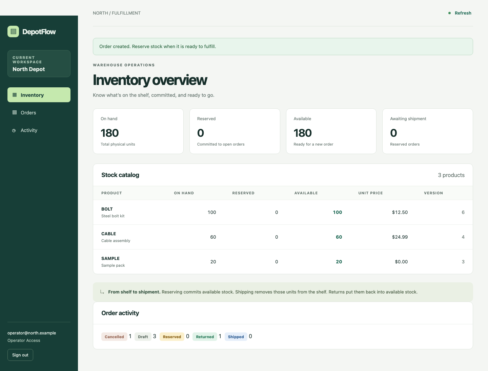

# DepotFlow

A complete local fulfillment workspace for the **North** and **South** warehouse organizations. Receive orders, reserve stock, ship, accept partial/full returns, adjust inventory, and inspect the audit history. Tenant and role boundaries are enforced in the API.



## Run locally

Use Python 3.10+ with SQLite support. Verified here with Python **3.12.14** and SQLite **3.53.1**. The application uses only the Python standard library; no package installation, frontend compilation, account, container, or external database is needed.

```sh
SEED_DEMO=1 PORT=8000 DATA_DIR="$PWD/data" ./run.sh
```

Open **http://127.0.0.1:8000**. `run.sh` is executable, binds only to `127.0.0.1`, and serves the UI and `/api` from that origin. Stop with Ctrl+C. Start again with the same `DATA_DIR` to retain orders, stock, sessions, audit history, and successful retry records.

| Environment variable | Behavior |
| --- | --- |
| `PORT` | HTTP port, default `8000`; `0` selects an available port and prints it |
| `DATA_DIR` | Persistent directory, default `./data` relative to this project |
| `SEED_DEMO` | Set to `1` to seed an empty store; existing tenants/stock are never reseeded |
| `PYTHON` | Optional Python executable override, default `python3` |
| `ACCESS_LOG` | Set to `1` for HTTP access logs; off by default |

The database is `DATA_DIR/depotflow.sqlite3`, with SQLite WAL sidecars while in use. A fresh store without `SEED_DEMO=1` has no users; enable seeding on its next start. To make another disposable demo, choose a new directory. For a file-copy backup, stop the server first and copy the whole data directory.

## Demo accounts

Every account uses the synthetic local password **`DepotDemo!2026`**.

| Role | North | South | Access |
| --- | --- | --- | --- |
| Admin | `admin@north.example` | `admin@south.example` | Orders, returns, stock adjustments, all read views |
| Operator | `operator@north.example` | `operator@south.example` | Orders, returns, all read views |
| Viewer | `viewer@north.example` | `viewer@south.example` | Read views only |

Each tenant independently starts with BOLT: 100 units at 1,250 cents; CABLE: 60 at 2,499 cents; SAMPLE: 20 at zero cents. Stock starts unreserved. The UI displays USD; stored/API money is integer cents.

## Use the workspace

1. Sign in. Inventory shows physical, reserved, and available units plus current order counts. Admins can record a signed stock adjustment with a reason.
2. Open **Orders → New order**, enter a unique client reference, and add one or more product lines. Zero-price SAMPLE orders are valid.
3. Open the order detail and **Reserve stock**, then **Ship order**. A reservation is all-or-nothing. Cancelling a draft or reserved order closes it and releases any reservation.
4. On a shipped order, enter arriving quantities and **Receive return**. Partial returns remain shipped; the final return closes the order as returned.
5. Use reference search, status filters, and Previous/Next to browse orders. **Activity** shows who made each committed change; order event links open its detail.

Controls show pending states and prevent double submission. A stale version reloads the current record while retaining your input. An unconfirmed network outcome retains the original request and key, including across a reload, and presents a safe retry action. Refresh loads changes made by another operator. Viewer screens contain no writable controls. The mobile layout supports the same workflow.

## API integration

`GET /api/health` is public and returns `{"status":"ok"}`. Sign in with:

```http
POST /api/session
Content-Type: application/json

{"email":"operator@north.example","password":"DepotDemo!2026"}
```

The response contains `{token,user:{email,role,tenant}}`. Send `Authorization: Bearer <token>` on subsequent API calls. Every business POST also requires a nonempty `Idempotency-Key`. Generate a new key for a new operation, retain it for retries, and send the same JSON payload/path when retrying. Failed operations do not consume a key. Successful replay returns the original status/body without another effect, including after restart.

| Endpoint | Purpose |
| --- | --- |
| `GET /api/me` | Current authenticated identity |
| `GET /api/inventory` | Tenant catalog, balances, prices, versions |
| `POST /api/stock/adjustments` | Admin: `{sku,delta,expected_version,reason}` |
| `GET /api/orders` | `status`, case-insensitive substring `q`, `limit` 1–100, opaque `cursor` |
| `POST /api/orders` | `{client_ref,lines:[{sku,quantity}]}`; 201 on creation |
| `GET /api/orders/<id>` | Order details, current version, price snapshots, cumulative returns |
| `POST /api/orders/<id>/reserve` | `{expected_version}` |
| `POST /api/orders/<id>/ship` | `{expected_version}` |
| `POST /api/orders/<id>/cancel` | `{expected_version}` |
| `POST /api/orders/<id>/returns` | `{expected_version,lines:[{sku,quantity}]}` |
| `GET /api/audit` | Oldest-first events; `limit` and `cursor`; includes useful `details` |
| `GET /api/dashboard` | Committed tenant order counts and stock totals |

Lists default to 20 items. Pagination returns `{items,next_cursor}` and preserves the first page's matching membership; new inserts are excluded until a fresh traversal. Order values remain current, so a later page can show an order whose status changed after the traversal began. Cursors bind tenant and filters and survive restart. Search treats `%` and `_` as literal text.

Errors are `{error:{code,message}}`. Invalid input is 400; bad/missing authentication 401; forbidden role 403; foreign/absent order 404; stale/state/stock/reference/retry conflicts 409. The UI displays actionable messages. See [architecture.md](architecture.md) for transaction boundaries, schema, constraints, failure recovery, and authentication details.

## Verification commands

Run the actual HTTP integration suite. It launches disposable server processes and reads persisted state to check invariants:

```sh
python3 -m unittest -v tests.test_api
```

Run the real Chromium workflow with the supplied tooling environment:

```sh
node scripts/browser.cjs
```

It connects to the provided isolated `EVAL_BROWSER_WS` browser, creates its own context and database, writes screenshots/results to `evidence/`, and closes its context, connection, and server. For an ordinary local environment without the supplied browser, optional Node/Playwright setup is provided:

```sh
./setup-browser.sh
PLAYWRIGHT_BROWSERS_PATH="$PWD/.local/browsers" node scripts/browser.cjs
```

Playwright is pinned in `package.json`. The browser installer is unnecessary for running DepotFlow. The supplied-browser path was exercised; downloading/installing Chromium on another machine was not. Temporary test databases stay under `.local/`; API/load fixtures clean themselves up, and browser fixtures retain synthetic data and server logs for investigation.

Run performance exercises sequentially, without the browser/API suite competing for the same CPU:

```sh
python3 scripts/load.py --concurrency 1 --output evidence/load-c1.json
python3 scripts/load.py --concurrency 8 --output evidence/load-c8.json
```

Each run creates a fresh store, preloads 200 draft orders, warms up with 100 reads and 20 five-request write workflows, then measures **30,000 reads and 6,000 write workflows (30,000 mutations)**. Reads evenly cover inventory, dashboard, order pages, and audit pages. A write workflow creates BOLT quantity 2, reserves, ships, returns 1, then returns 1. The two tenants are exercised independently. Final checks require original stock, zero outstanding reservations, 30,300 audit events, a clean integrity check, and no foreign-key violations.

The harness uses one persistent HTTP/1.1 loopback connection per worker, closed-loop requests with no think time, and a shared client/server host. Latency spans request send through complete response body; percentiles use linear interpolation. Startup, login, prefill, and warmup are excluded. Override `--read-requests`, `--write-workflows`, and `--prefill` to vary the exercise. Unexpected HTTP/network errors or final-state failures produce a nonzero exit.

## Actual checks and results

Verified on **2026-09-27**, macOS 27.0 / arm64, **10 logical CPUs**, Python 3.12.14, SQLite 3.53.1, Node 24.19.0, Playwright 1.62.1. CPU model and physical memory were not exposed by the sandbox, so neither is assumed.

* **26 API integration tests passed.** They cover authentication, both roles/tenants, numeric and payload validation, zero-price orders, every transition, atomic multi-line failures, stale versions, concurrent reservations/returns, twelve identical concurrent retries, exact event counts, fault-injected rollback, signed pagination, and abrupt process restart without reseeding.
* **14 browser checks passed**, with no JavaScript page errors. Desktop 1440×1050 and mobile 390×844 workflows include a deliberately lost successful response, safe replay after reload, preserved stale-version input, double-submit prevention, admin/viewer behavior, tenant switching and draft-input cleanup, search, literal client text, and keyboard login.
* Python compilation, JavaScript syntax, shell syntax, and the supplied-tooling branch of `setup-browser.sh` passed.

Performance results and their tail-latency limits are recorded in [evidence/verification.md](evidence/verification.md). Raw measurements: [one worker](evidence/load-c1.json), [eight workers](evidence/load-c8.json). They are local measurements, not a capacity promise. In particular, SQLite serializes writers and requests can queue substantially longer than median latency.

Evidence: [API output](evidence/api-tests.txt), [browser output](evidence/browser-tests.txt), [browser result details](evidence/browser-results.json), [desktop order](evidence/desktop-orders.png), [desktop audit](evidence/desktop-audit.png), [mobile order](evidence/mobile-order.png), [mobile inventory](evidence/mobile-inventory.png).

## Design choices and limits

The stack favors inspectable code and reproducible local startup: Python HTTP server, SQLite WAL with `synchronous=FULL`, and an HTML/CSS/JavaScript frontend. Stock, order versions, audit events, and successful retry responses commit in one transaction. A signed cursor plus audit status history preserves pagination membership without extra pagination storage. There are no remote dependencies, background services, or external side effects.

This is a local application, not an internet deployment. The HTTP server has no TLS, distributed rate limiting, or production process supervisor. Accounts/catalog come from the demo seed; there is no provisioning/reset/catalog editor, migration framework, or automatic backup scheduler. Sessions expire after 12 hours; sign-out clears the tab's token and state but does not revoke an independently copied token. Use the synthetic demo accounts only.

SQLite permits a single writer; list serialization performs per-order line reads, and substring search scans tenant references. Successful retry records and audit events are retained indefinitely. Payloads are capped at 64 KiB/100 lines; inventory and quantities at 1 billion per SKU. External edits appear on Refresh rather than through live push. Tests exercise finite interleavings and acknowledged-commit process restart; they do not prove all possible schedules or sudden-power-loss durability. No deployment, real customer data, external database, paid service, or helper model was used.
