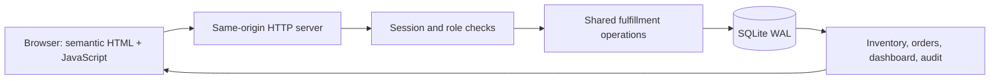

# DepotFlow architecture

## Boundaries and ownership

The application is a single Python process serving a plain JavaScript UI and a JSON API on `127.0.0.1`. SQLite is the authoritative store. The application runtime has no third-party dependencies or build step. Node/Playwright are optional verification tools.

`depotflow/server.py` owns HTTP parsing, response headers, authentication entry points, connection lifetime, and transaction boundaries. `service.py` owns validation, authorization, the state machine, serialization, pagination, and all business writes. `db.py` owns schema/bootstrap/password hashing. The frontend consumes the same public API as the integration tests and workload generator.

Inventory, order details, and dashboard counts are projections of committed database state, not independently maintained caches. Order prices are copied from the tenant's inventory catalog at creation. Client fields cannot replace identity, prices, status, totals, returned quantities, or versions. Cents and quantities stay integers throughout storage and API serialization; the UI formats cents as USD only for presentation.

## Persistent model and tenant isolation

| Table | Purpose and constraints |
| --- | --- |
| `tenants`, `users` | User email maps to one tenant and one checked role; salted password hashes |
| `sessions` | SHA-256 token digest, user email, 12-hour expiry |
| `inventory` | Composite primary key `(tenant, sku)`; nonnegative on-hand/reserved, reserved ≤ on-hand |
| `orders` | Global opaque UUID and increasing internal sequence; unique `(tenant, client_ref)` |
| `order_lines` | Price snapshots and cumulative returns; composite foreign keys to tenant-owned order and inventory |
| `audit` | Increasing event ID, tenant, actor, UTC timestamp, action, entity, structured details, resulting order status |
| `idempotency` | Unique `(tenant, key)`; request fingerprint, original successful HTTP status and response body |
| `metadata` | Schema version and durable cursor-signing secret |

Every domain read/write includes the authenticated tenant in its predicate. Identity comes from the persisted user associated with the bearer token. Client tenant/role headers and fields are never trusted. Order lookup in a different tenant returns 404. Database foreign keys reinforce tenant boundaries for order lines. SQLite does not supply row-level authorization; access controls remain application responsibilities, with route tests exercising each surface.

## Invariants and transitions

* `available = on_hand - reserved ≥ 0`; `on_hand ≥ reserved ≥ 0`.
* Line quantity is positive; returned quantity is between zero and the original shipped quantity.
* Catalog price is nonnegative, and `total_cents` equals the sum of snapshotted line prices times original quantities. Returns do not rewrite the original order total.
* Draft and cancelled orders reserve nothing. Reserved orders contribute their full line quantities to inventory reservations. Shipped/returned orders reserve nothing.
* Successful order transitions increment the order version once. Each affected inventory row increments its inventory version once. Creation starts at version 1.
* One successful business mutation produces one audit event, independent of its number of lines. Seed records and sessions do not produce business audit events.

| Action | Required state | Stock effects | Result |
| --- | --- | --- | --- |
| Create | Valid nonempty unique-SKU lines | None | Draft, version 1 |
| Reserve | Draft; enough available for every line | Increase reserved | Reserved |
| Ship | Reserved | Decrease on-hand and reserved equally | Shipped |
| Cancel | Draft or reserved | Release reservations if present | Cancelled |
| Return | Shipped; cumulative return ≤ each shipped quantity | Increase on-hand | Shipped until every line is fully returned, then returned |
| Adjustment | Admin; matching inventory version; nonzero delta/reason | Change on-hand without crossing reserved floor | Updated inventory item |

## Transaction and failure boundaries

Each request opens its own SQLite connection, enables foreign keys, and closes the connection on every exit. WAL permits concurrent readers; SQLite serializes writers. Connections use `synchronous=FULL` and a 15-second busy timeout.

Before accepting a mutation body, identity and role are checked without holding a write lock. After the body is parsed, `BEGIN IMMEDIATE` obtains the write lock. The transaction then rechecks identity and authorization, resolves idempotency, validates expected versions and business rules, writes all stock/order/line changes, appends the audit event, and stores the successful replay response. It commits before any successful response is sent over HTTP. Any exception rolls back all these effects. An audit-insertion fault is injected through the real server in the integration suite to verify this boundary.

Concurrent reservations cannot both decide from the same available stock: the second writer observes the first writer's commit. A simultaneous edit to the same order with a distinct key sees the new version and returns 409. A simultaneous identical request sees the committed retry record and returns the original success.

GET projections run in an explicit read transaction. A dashboard's counts and sums therefore come from one committed snapshot. Separate browser requests can observe successive snapshots if another operator is working; there is no push stream or global snapshot across HTTP requests. The UI reloads the relevant views after a confirmed change and offers Refresh for external changes.

## Retry identity and recovery

Every business POST requires a nonempty `Idempotency-Key` of at most 200 characters. Keys are shared across endpoints within a tenant. The fingerprint hashes the method, exact endpoint path, and canonical JSON body. JSON object-key order does not affect identity; array order and JSON numeric representation do. Unknown extra fields are ignored for business authority but remain part of retry identity.

A matching key returns the original status/body, even if the order has since advanced. A different method/path/payload under that key is a conflict. Authentication/authorization happen before replay, so a viewer cannot obtain a cached mutation success. Failed requests leave no key behind. Successful keys have no expiry and survive restart; unbounded retention is an explicit storage tradeoff.

The browser generates a key once per user intent, disables duplicate submissions, and retains unconfirmed requests in session storage before sending. Network errors and server failures keep the original intent for explicit safe retry, including after reload. Other mutations are blocked while an outcome is unknown. A confirmed business rejection preserves form input. A stale-version rejection reloads current values, keeps entered quantities/reasons, and requires the user to review and resubmit. The UI distinguishes a saved change followed by a failed refresh from an unconfirmed mutation.

An abrupt process kill after successful responses is covered by restart tests. Crash exactly during disk commit, sudden power loss, disk exhaustion, and corrupt storage have not been simulated. SQLite transactions provide the storage boundary; no external shipping or payment effects are part of this application.

## Stable pagination

Orders use an increasing internal sequence and audit events use increasing IDs. Signed cursors bind the tenant, collection, normalized search/filter, last seen sequence, and first-page high-water marks. Cursors survive process restart because their HMAC secret is persisted. They cannot be reused for another tenant, collection, or filter, and malformed/tampered cursors return 400. Page size can change within the traversal.

Keyset pagination excludes later inserts and avoids offset shifts. Client references are immutable. For a status filter, historical resulting status is read from the audit table at the first page's audit watermark. Therefore a pre-existing match is not omitted if its status changes before a later page. Membership is fixed for the traversal; returned order values are current, so such an order may display a newer status. Starting a fresh search or refreshing filters obtains current membership. Audit membership is naturally append-only. No pagination snapshots need to be retained as separate server sessions.

## Authentication, frontend, and error handling

Passwords use PBKDF2-HMAC-SHA256 with 210,000 iterations and independent random salts. Session tokens contain 256 bits of randomness; only token digests are persisted. Authentication checks expiry and reads the user's current role each time. Tokens are supplied in an Authorization header, not a cookie. Login performs password hashing even for unknown users. Sessions last 12 hours; expired sessions are removed on successful login. Sign-out clears this browser tab's session and UI state. It does not revoke other copies of the token before expiry.

The UI uses native buttons, labels, inputs, and selects. It renders arbitrary strings through text nodes and has no `innerHTML` path. Content Security Policy allows only same-origin scripts/styles/connections, prevents framing, and disallows inline scripts. Desktop tables scroll within their panels on narrow screens; the navigation becomes a horizontal row. Viewers receive no writable controls, and the server independently enforces their role.

Errors use `{error:{code,message}}`: 400 for invalid inputs/cursors/keys; 401 for absent, expired, invalid credentials; 403 for disallowed roles; 404 for absent or foreign orders; 409 for stale versions, state/stock/return/reference/idempotency conflicts. Oversized bodies return 413; unsupported methods return 405; lock timeout returns a retryable 503. Unexpected errors return a generic 500 and log a server-side traceback without request bodies or bearer tokens. Access logs are off unless `ACCESS_LOG=1`.

Payloads are limited to 64 KiB and 100 unique lines. References are at most 200 characters, reasons 1,000, and quantities/on-hand at most 1 billion per SKU. JSON booleans, fractional numbers, nonfinite values, duplicate fields, and invalid UTF-8 are rejected where appropriate. These explicit limits prevent integer overflow and keep JSON integers representable by the browser.

## Scope and reuse

Validation, tenant lookup, serialization, inventory updates, event insertion, and idempotency run through shared functions for every business endpoint. There are no external calls inside transactions. The workload and tests use real HTTP endpoints and independent server processes; direct database access in verification is limited to assertions and deliberate fault injection.

This is a local application for the supplied two-operator use case. The standard-library HTTP server has no TLS termination, account provisioning, credential recovery, distributed rate limiting, background jobs, backups, schema-upgrade tooling, or production process supervisor. SQLite's single writer and per-order line queries on list pages bound scalability. The recorded benchmark is evidence for this local workload, not an internet-facing capacity guarantee.
