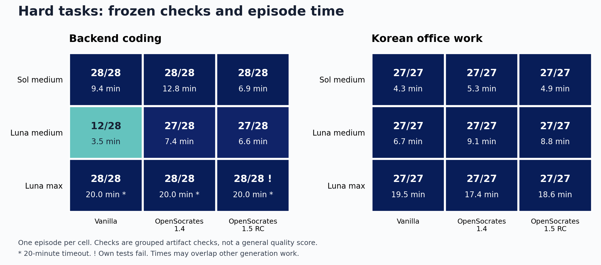

# Hard coding and office comparison

The fixed comparison is complete: **18 model invocations,15 completed CLI turns
and3 timeouts**, with no outcome retries, model substitutions or candidate repairs.
All three timeouts are Luna max coding episodes; their retained programs are
assessed separately. All108 backend load cells and709,858 raw timing samples are
retained and independently recomputed. No historical protocol, candidate, score
or failure was changed.

The strongest bounded improvement is in **Luna medium coding**: vanilla passes
12/28 API groups, while both plugin conditions pass27/28. This is not a clean
v1.5-over-v1.4 win: their remaining defects differ, and Sol already passes28/28
in every condition. Luna max reaches28/28 in all conditions but exceeds the CLI
time budget in all three, and its1.5 refactor leaves an existing test uncompilable.
Office arithmetic/allocation ties at27/27 across all nine cells; prose and workbook
review still finds meaningful errors. The candidate does not consistently improve
maintainability or performance in these examples.

See [complete metrics](METRICS.md), [source review](SOURCE_REVIEW.md),
[portable verification](REPRODUCE.md), [summary](summary.json) and
[the outcome lock](outcomes.lock.json).

## Coding results

| Tuple | Vanilla | Released1.4 | Candidate1.5 |
| --- | --- | --- | --- |
| Sol medium |28/28; own tests pass;562.3s|28/28; own tests pass;768.2s|28/28; own tests pass;414.8s|
| Luna medium |12/28; own smoke passes;207.2s|27/28; own smoke passes;443.1s|27/28; own smoke passes;395.4s|
| Luna max |28/28; own smoke passes;1200s timeout|28/28; own smoke passes;1200s timeout|28/28; own test build fails;1200s timeout|

Luna medium vanilla splits operation effects from idempotency storage, reads
through the pool instead of its transaction, imports current legacy balances
incorrectly and leaves reversal behavior incomplete. The1.4 artifact fixes those
boundaries but permits reversing a reversal. The1.5 artifact fixes that provenance
rule but accepts `PUT /accounts` as a write and uses immediate transactions for
reads. The Max1.5 artifact replaces `platform.Open` without updating the supplied
test caller: `undefined: Open` is a real generated-project integration defect.
These facts explain the differences better than file count or functional syntax.

Only Sol vanilla and Sol1.4 add reusable Go domain tests. Sol1.5 puts its application
in the command package and adds no domain test, despite passing the external suite.
The larger Max1.5 module split still leaves the broken caller. No generated
artifact was patched to improve its score.

## Office results and review

Every cell produces all five required business artifacts, preserves all inputs,
and passes27/27 objective groups. Each chooses CEDAR/S2/S3/S5/S6, preserves101
physical accounting rows and36 balances, covers60 mandatory plus6 optional staff,
reserves787,600KRW and spends962,000KRW from the965,000KRW launch budget. The
supplier-selection signature stays pending and independent preparation continues.

| Tuple | Vanilla provisional prose /20 | Released1.4 /20 | Candidate1.5 /20 |
| --- | ---: | ---: | ---: |
| Sol medium |20|20|19|
| Luna medium |15|18|18|
| Luna max |20|20|19|

These are unblinded primary-agent rubric judgments, **not human ratings or a
calibrated version/model ranking**. All51 public office messages were inspected;
no unnecessary question was observed. The task supplies the facts needed for
planning, so this does not test a genuinely missing user decision.

Concrete findings matter more than small score gaps:

- Luna medium vanilla invents S1 availability for P064 in its memo, contradicting
  input A064 and its own correct JSON. Its proposed S1 recovery is infeasible;
  narrow workbook columns also clip labels.
- Luna medium plugin memos avoid that invented availability, but do not explain
  P064's individual waitlist constraint as clearly as the Max memos. The1.5 memo
  has ambiguous wording about excluding the unapproved70,000KRW addition.
- Luna max1.5 describes25 people in a rejected alternative where the corrected
  total is26. Both exceed capacity18, so the selected plan stays valid. The1.4
  Max memo's25-person figure is explicitly a regional subset, a valid lower bound;
  it must not be falsely judged as the same error.
- Sol1.4 and1.5 workbooks format attendee counts as currency. Sol1.5 also writes
  a misleading chained equation, while its stored amounts and final total are
  correct. The frozen numerical checker does not assess these display/narrative
  defects; its original27/27 scores are unchanged.

The nine structured reviews and their pre-review locks are under `review/`.
Workbook inspections are read-only. One preview omission of the Max1.5 currency
format was checked against native XLSX styles and classified as a renderer limit,
not a candidate error. Korean artifacts are present in all cells; some Max public
messages are English, which the artifact-specific language contract permits.

## Qualified performance and failures

The host is an Apple M5 with10 CPU cores and32GiB RAM, macOS27.0 build26A428;
each backend uses `GOMAXPROCS=4`. The following are medians of three repetitions
at concurrency16. Full concurrency1/16 ranges, CPU and RSS appear in METRICS.md.

| Fully eligible artifact | Historical read RPS | Read p99 ms | Write RPS | Write p99 ms |
| --- | ---: | ---: | ---: | ---: |
| Sol medium / vanilla |189.2|215.30|2188.6|30.33|
| Sol medium /1.4 |261.4|140.12|2639.6|57.23|
| Sol medium /1.5 |141.6|469.68|1364.2|53.13|
| Luna max /1.4, retained timeout artifact |471.8|83.60|2603.6|96.78|

The Sol1.5 artifact is slower than both controls in these read/write throughput
cells. A shorter generation call did not yield a faster or better-tested program.
Query plans, connection ownership and journal settings differ, so this is an
observed artifact regression, not an isolated causal estimate of the plugin.

There are111 failed workload requests:63 warmup and48 measured starts. Seven
load cells fail their all-attempt gate. Luna medium vanilla times out on all32
requests in each of three concurrency16 write cells and its final state cannot
be read. Luna medium1.5 has6/2/6 warmup read timeouts at concurrency16. Luna max
vanilla has one warmup write timeout; its measured-window requests and final
conservation pass, but the frozen rule retains the failure. Consequently only
four artifacts have eligible performance. Fast values for the other five stay
diagnostic; no load cell was rerun for a favorable result.

## Usage and delivery

Observed work is620 tool actions:58 failed exit/status projections and2 unresolved
actions without completed events. All18 calls are counted. Reported usage covers
15 calls:17,729,624 input tokens (16,292,864 cached subset),382,408 output tokens
(155,786 reasoning subset), and explicit cache-write0. All five categories are
null for the three coding timeouts. Summed call time is12,057.610 seconds and
includes overlap; it is not elapsed study time. Preparation and primary integration
usage are separate and unavailable, not zero.

For example, Luna medium1.5 office uses54 tool actions versus18 for1.4 and20 for
vanilla, without an objective-score gain. Luna max office takes17.4–19.5 minutes,
versus6.7–9.1 minutes at medium; its vanilla memo avoids the medium memo's invented
P064 availability, but this one example cannot establish a general effort policy.
Missing Max coding usage prevents a complete token-efficiency comparison.

No native adapter operation is recorded in these optional-memory episodes;
direct decision commands remain separate lexical evidence. All18 local native
memory output/job tables are empty, which does not prove account-side isolation.
Native packs, agent-reported reading and actual application remain distinct.

## Scope and identities

The requested comparison uses **Sol medium, Luna medium and Luna max**. Each tuple
receives the same difficult coding task and Korean office task in three separate
conditions: vanilla Codex, the actual published OpenSocrates1.4 package, and the
current unpublished1.5 candidate. There is one episode per cell, not repeated
model sampling:18 initial invocations,1200 seconds each, no outcome retry or model
substitution. Each has a fresh disposable profile and context. No stronger model
supplies answers or repairs inside a Luna episode.

Inputs were committed before the first outcome at
`9a6a1bacaf63e9bfb4781d04205493e4ee0f41d2`. The manifest digest is
`8fafe6f815d30724ac4f5568cf494bcfd0a4d38dfe56de0054aebf8e3732c00e`.
It freezes50 files plus package/runtime identities. The starting repository head
was `8244c9786d289bec9f81314edb4cd9d59a54e093`; unchanged runtime product source is
`391dd8e71c9842716c5113af35cd25bdde6206b3`.

| Identity | Frozen value |
| --- | --- |
| Client | ChatGPT desktop bundled `codex-cli0.158.0-alpha.2` |
| Client launcher SHA-256 | `50ab38ba21d0d9f8346f32f41848382f15b556190f3c7a07e885a4fb73e379c8` |
| Released1.4 archive | `74efeab5797de766dabf8394506e29bcb39df3d1b3aac93a5a9ec17a32909a33` |
| Candidate1.5 archive | `f26b77374e38261acd3296739093a4e388f1cd25cdef48a2b3de16dec0417b7d` |
| Coding toolchain | Go1.26.3, darwin/arm64; modernc.org/sqlite1.59.0 |
| Office toolchain | Bundled Python3.12.14; openpyxl3.1.5 |

The1.4 archive was downloaded from the published release. A local development
archive with a1.4 filename is a different artifact and is not this baseline.
Candidate guidance remains assistance8, documentation1, impact3, maintainability2
and reuse2. No active installation, global memory/settings, credentials or real
project enrollment was changed. The package remains a release candidate and PR95
remains Draft.

Actual streamed work was observed for all three requested tuples; catalog support
alone is not the access evidence. Independent backend model echo and billing are
unavailable. Input/cached-input/output/reasoning-output categories are reported as
the client supplied them; cached input and reasoning output are subsets, not
additional totals. Missing completed-turn usage remains null, including timeouts.

## What the tasks measure

**Coding:** AuditLedger is an11-route Go/SQLite resource ledger. Its28 independent
groups cover tenant isolation, atomic staged batches, idempotency and replay,
optimistic versions, reservations/capture/release, compensating reversals,
historical summaries/pagination, restarts, concurrent writers and migration from
a genuine old-format database. The supplied starter has generic driver scaffolding
and a legacy producer, not a business implementation. Source review checks shared
rules, ownership and test coverage; module count or functional syntax is not a
quality score.

**Office:** twelve files contain263 tabular rows plus approved constraints, current
supplier terms, an English correction and a maintained predecessor note. The work
requires revision/deduplication accounting, zero-value and reversed records,
approved HR changes, accessibility, workday preparation, allocation and a
lexicographic budget objective. Five required business artifacts must agree:
two CSVs, JSON, a six-sheet XLSX and a Korean decision memo. The frozen checker has
27 groups. Memo judgment uses a separate five-dimension rubric; scores are
provisional, unblinded primary-agent assessments. Human scores remain unavailable.

The same accepted intent and current facts are available in all conditions through
maintained notes. The candidate additionally has optional enrolled synthetic
memory with those same facts. No memory operation is forced simply to increase
a counter. This is a single-session comparison, so it does not isolate a
fresh-session memory effect or a follow-up change cost. Official network lookups
are disabled for these self-contained tasks; they are not a new live test of the
documentation feature.

The plugin conditions explicitly read their installed controller. Hooks, apps,
multi-agent tools, native memory generation/import and remote-plugin discovery are
disabled in the disposable configuration. This tests installed guidance under a
common host configuration; it is not a claim of normal-hook activation. The prompt
permits loopback tests only, while the sandbox network flag must allow those tests;
it is not an independently verified network-egress firewall.

Backend performance follows correctness: each binary receives a10002-entry seed
through the public API and fresh SQLite clones for read/write workloads,
concurrency1/16, three repetitions, one-second warmup and five-second windows.
Only starts and successful completions inside the same window earn throughput;
latency includes drain for requests starting in the window. All samples, failures,
warmup carry-in and drain remain counted. A failed correctness/conservation gate
makes throughput diagnostic. The Python client and shared host can constrain
throughput; this is not a production capacity or plugin-runtime speed claim.

## Preparation and execution notes

- Two independent Sol/high preparation authors wrote the tasks/checkers without
  candidate outcomes. One office follow-up repair makes three preparation turns;
  their usage is unavailable and separate from outcome calls.
- Before freeze, review repaired Excel ROUND tie handling, quoted formula IDs,
  unsupported criteria handling, schema/header validation and warmup carry-in
  counting. Office positive, alternative-allocation and negative controls pass.
  Coding primitive/negative controls pass; no full reference server was supplied.
- The app worktree tool was unavailable from the parent directory; isolated manual
  author worktrees were used. An initial wrong manifest-hash argument was rejected
  before any outcome. All three installation preflights passed with zero model calls.
- Office artifacts are checked read-only as completed batches arrive. Coding
  qualification and serial performance wait for generation to finish. This changes
  no frozen task, rubric, candidate or score. Qualification-order receipts and
  pre-review input locks record the order.
- Original model event streams/private reasoning are not retained in this export. Public messages, command
  receipts, synthetic artifacts and usage are retained within this evaluation
  directory; product memory contains no raw prompts, transcripts or source copies.

## Native request diagnostic

The completed plugin episodes include rejected decision requests. The original
command text is retained, but native decision stdout is not available as a
universal receipt; model statements about it remain agent reports. A separate
[five-call native-only diagnostic](review/decision-diagnostics.json), with zero
model calls and disposable state, isolates three closed-contract violations:

- A hyphenated decision ID is invalid; the same office features with an alphanumeric
  ID select `trade-off-analysis`.
- Omitting `operation` is invalid; changing other fields cannot repair that omission.
- `governing_rule` is a feature key, not a valid feature basis. With the same coding
  features and valid `task_shape` basis, the runtime returns `no_intervention`.

The runtime correctly enforces its contract and creates no memory directory in
these probes. The generic `invalid_decision_request` response offers weak repair
guidance. Field-specific diagnostics and a clearer envelope contract are a
concrete product/guidance improvement candidate; their benefit is not isolated by
this study. No diagnostic answer or repair is fed back into an outcome cell, and
the compared package bytes remain frozen.

The client-path audit found that the frozen digest identifies a shell launcher.
The actual Mach-O executable digest was first recorded after seven completed cells:
`c3e30211bd454da70ceb4d9cbc2e05fe6466812ab05c311c3bbff6addeb14202`.
Its observed modification time predates this run and the version remains
0.158.0-alpha.2, but that later digest is not retroactive pre-call hash evidence.
See [the supplemental client observation](client-observation.json). Disposable
vanilla and candidate profiles also started a host-provided XcodeBuildMCP process;
completed action projections at that observation contain only commands/file edits,
with no MCP tool calls. Vanilla means no installed OpenSocrates plugin here, not
proof that the desktop client exposes no other common host tools.

## Limits

There is one generated artifact per tuple/condition/domain. Load repetitions are
measurements of that one artifact, not additional model trials. Episode wall time
may overlap another model/build and is descriptive. Deterministic checks do not
prove every narrative statement: for example, an otherwise correct first-batch
Luna max office memo counts25 people in a rejected alternative where approved HR
changes imply26. Both exceed capacity18, so the selected plan is unaffected; the
prose finding is preserved separately from its original27/27 score.

Account-side native-memory isolation, human ratings, billed cost and independent
backend echo remain unproven or unavailable. They limit interpretation; they are
not newly imposed release prerequisites. No broad model superiority, universal
quality improvement, profile promotion or publication follows from this run.

## Verification and handoff

`python3 evals/v1.5/hard-tasks/v1/verify.py --complete --storage /private/tmp/opensocrates-hard-run-20260927`
passes:50 frozen inputs,18 accounted calls,311 retained artifacts, complete outcome
and review-input locks, unchanged protected inputs and all finished auth copies
removed. The independent numeric audit reproduces108 cells/709,858 samples from
both private raw records and portable lossless exports. All six candidate accepted
memory records remain exactly unchanged; no raw artifact or transcript entered
product memory. The actual client executable remains unchanged from the explicitly
later supplemental observation through the end of execution.

`python3 evals/v1.5/revision-v3/verify.py` passes, including539 runtime input hashes
matching the already qualified candidate package source. Exact Git-blob comparison
against pre-study head8244c978 verifies3131 historical evaluation files unchanged,
excluding only the intentionally updated current STATUS.md. The source, guides,
schemas and native archive used by the comparison remain unchanged. No new local
native rebuild is needed for these evaluation/report-only changes; exact-head CI
still runs the required native package jobs.

The full CONTRIBUTING source command and final exact-commit CI results are recorded
in Draft PR95 and issue94:
`make bootstrap format-check lint generated-check content-check adjudication-check docs-check governance-check package-check security-scan smoke installer-check`.
New backend/performance observations are macOS-only. Live Windows Codex remains
unavailable; hosted native Windows checks do not substitute for that cell. No
destructive host test, account-home purge, release/version change or active-install
replacement was performed for this comparison.

`act_standardize_decision`: keep the existing task fallback and inactive profile
status. The evidence supports a concrete Luna-medium coding improvement over its
vanilla artifact, several ties, and candidate regressions/unfinished integration;
it does not support promoting1.5 or Max as a universal quality/efficiency default.
Finish this bounded comparison without new outcome calls. The next review action
is to assess these artifacts and the narrow native-envelope recovery improvement
candidate. Merge, tag, publication and installation changes require separate
authorization; PR95 remains Draft.
